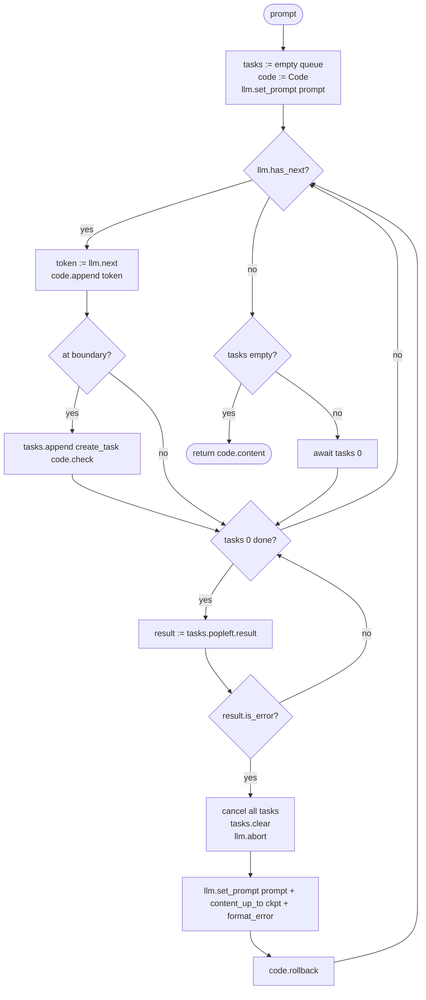

# Draft Plan 0 — Comparing Three Decoding-time Verification Strategies

*CMSC 25750 quarter project · paper draft seed · 2026-05-10*

## 1. Overview

### 1.1 Research question

When generating compilable code with an LLM, where in the loop should the static-analysis signal enter? Three points are in the literature or in the wild:

- **Raw** — generate freely; check at the end with a compiler.
- **MGD** (Agrawal et al., NeurIPS 2023) — block invalid identifiers *as they are decoded* using LSP completions.
- **Rollback** (this work) — let the LM write; at statement / block boundaries pull diagnostics; if blocking, truncate to the last good checkpoint and resume.

These differ in *what signal* is used, *when*, and *what action* is taken on a hit. They have not been measured side-by-side on the same benchmark in the same language. The paper's contribution is that comparison plus an analysis of when each pays off.

### 1.2 The arms

| | (i) raw | (ii) MGD | (iii) rollback | (iv) MGD + rollback |
|---|---|---|---|---|
| Judge | compiler (post-hoc) | LSP completions | LSP diagnostics | both |
| Granularity | whole file | sub-token at trigger sites | statement / block | both |
| Speed | fastest | slow | mid | slowest |
| LSP cost | none | high (every identifier expansion) | low (boundary-cadence) | high + low |
| LM waits for LSP | never | at every trigger | only after a block when ambiguous | trigger + boundary |
| LSP action on hit | none | logit reshape (mask) | truncate to checkpoint | mask then truncate |

Arm (iv) is included because every reviewer will ask. The two signals are orthogonal — masking prevents *wrong identifiers*; rollback catches *type and structural mistakes that survive the mask*. (i)/(iii) are the headline; (ii)/(iv) are baselines and ceilings.

### 1.3 Hypotheses

- **H1.** Arm (iii) > arm (i) on compile rate and pass@1, with smaller advantage on pass@1 than on compile (rollback is engineered to compile, not to be correct).
- **H2.** Arm (ii) ≥ arm (i) on compile rate, but at large wall-clock cost; the same arm's pass@1 is only marginally better than (i) — MGD optimizes for *symbol resolution*, not full correctness.
- **H3.** Arm (iv) ≥ max((ii), (iii)) on compile rate. Whether (iv) > (ii) + (iii) on pass@1 is the actual open question — if the two errors classes are disjoint, yes; if MGD already catches most of what rollback would, the marginal gain shrinks.
- **H4.** Wall-clock ordering: (i) < (iii) < (ii) ≤ (iv).

### 1.4 Contributions

1. First side-by-side comparison of pre-emptive (MGD) vs. reactive (rollback) decoding-time verification on a single benchmark.
2. A minimal, reproducible rollback implementation built on multilspy + vLLM that doesn't require a custom inference stack.
3. An empirical answer to whether the two strategies stack (arm iv).

## 2. Background — MGD

### 2.1 Mechanism

MGD inserts a **monitor** between the LM and the decoder. Its state machine has two modes:

- **Wait** — the LM samples freely from the original distribution.
- **Active** — the monitor was just triggered (e.g., the LM emitted `.`). It queries the LSP for valid completions at the cursor, intersects them with the LM's vocabulary, and masks every token that cannot extend any valid completion. The mask is applied to the logits *before* the next sample. After the LM commits a non-identifier character, the monitor returns to wait.

Formally, the sampling distribution is

$$
p(x_{n+1} \mid x_{1:n}) =
\begin{cases}
\mathrm{softmax}(\ell) & \text{wait state} \\
\mathrm{softmax}(\ell \oplus m) & \text{active, mask } m
\end{cases}
$$

where $\ell$ is the raw logit vector and $\oplus$ sets masked positions to $-\infty$.

### 2.2 Evaluation in the paper

- **PragmaticCode**: 100 real-world Java repositories released *after* the LM training cutoff (no contamination).
- **DotPrompts**: 1,420 Java methods → **10,538 dereference-completion prompts**, each truncated at a `.`.
- **Models**: CodeGen-{350M, 2B, 6B}, SantaCoder-1.1B, text-davinci-003.
- **Metrics**: compilation rate (CR), next-identifier-match (NIM), identifier-sequence-match (ISM), prefix-match (PM). Sampled at top-p = 0.95, n = 6, aggregated as score@k.
- **MGDMicroBench** (Section 5): C# + Rust feasibility case studies for additional monitor types (class instantiation, switch-over-enum, argument arity). Not a full eval.

### 2.3 Limitations the paper acknowledges

1. **Java-focused** — generalization to other languages relies on case studies, not full evals.
2. **Trigger points only** — errors *between* triggers (type mismatches, control flow, logic) are not caught.
3. **No rollback** — if the mask becomes empty, the run is abandoned; "backtracking and beam-search" are explicitly listed as future work.
4. **Compilability ≠ correctness** — CR improves dramatically; functional correctness is not measured.

### 2.4 What this work picks up

This work directly addresses (2) and (3): rollback at statement boundaries catches errors between MGD triggers, and it is by construction the backtracking mechanism MGD lacks. It also targets a language (Rust) outside MGD's main evaluation, addressing (1).

## 3. Method

### 3.1 The four arms

**Arm (i) — Raw.** Stream from the LM until EOS / max-tokens. Run `cargo check`. Done. No verification in the loop.

**Arm (ii) — MGD.** A `LogitsProcessor` registered with vLLM. On each generated token, the processor inspects the current text. If the trailing sub-string ends in a Rust dereference site (`.`, `::`), it queries rust-analyzer (via multilspy) for completions at the cursor and builds a mask over the LM's vocabulary, leaving only tokens whose first character can begin a valid completion. After the LM emits a non-identifier character, the processor returns to wait. No truncation is performed; if the mask is empty, the run is recorded as an MGD-abort.

**Arm (iii) — Rollback.** Stream tokens; concurrently watch for blocking LSP diagnostics. If one fires, truncate the buffer to the last clean block boundary and resume sampling from there. The rest of this section is about (iii).

Two sub-variants are reported separately:

- **(iii-mute) Rollback-mute** — on a blocking diagnostic, truncate to the last checkpoint and re-prompt the LM with the original prompt + the surviving content. The LM is *not* told what went wrong.
- **(iii-instruct) Rollback-instruct** — same as mute, but the formatted error message is appended to the re-prompt as an instruction. This is closer to a Self-Refine / Reflexion-style loop. The two variants share a single code path; only the `format_error` call differs.

The pair lets us measure how much of the rollback gain is *correction-from-truncation* versus *correction-from-being-told-what-broke* — a question vanilla rollback systems can't answer.

**Arm (iv) — MGD + rollback.** Both the logits processor of (ii) and the watcher of (iii) are active. The processor masks at trigger sites; the watcher truncates at boundaries when diagnostics fire. Rollback can also be triggered by an MGD-abort (empty mask) — in that case we rewind to the last checkpoint and re-sample, instead of failing the whole run.

### 3.2 Rollback algorithm (pseudocode)

The loop is producer–consumer: the *producer* pulls one token at a time from
the LM (blocking on the LM, fast); the *consumer* drains a FIFO queue of
in-flight LSP checks (non-blocking when empty, blocking only at stream end).

```python
async def generate(prompt: str) -> str:
    tasks: deque[asyncio.Task] = deque()
    code = Code()
    llm_server.set_prompt(prompt)

    while True:
        # 1. Produce: pull one token if the LM still has output.
        if llm_server.has_next():
            token = llm_server.next()                 # blocking on LM
            code.append(token)                        # sync: mutate buffer
            if code.at_boundary():
                tasks.append(asyncio.create_task(code.check()))

        # 2. Consume: drain completed checks from the head of the queue,
        # in submission order. Out-of-order completion does not matter —
        # we wait for the head before considering anything behind it.
        while tasks and tasks[0].done():
            result = tasks.popleft().result()
            if result.is_error:
                # Cancel still-running checks for content we're about to
                # discard, so they cannot mutate code state after rollback.
                for t in tasks:
                    t.cancel()
                tasks.clear()
                # Abort the LM and re-prompt with the surviving prefix.
                # format_error() is "" for rollback-mute, the rendered
                # diagnostic for rollback-instruct.
                llm_server.abort_current_stream()
                llm_server.set_prompt(
                    prompt
                    + code.content_up_to(code.ckpt[-1])
                    + format_error(result.message)
                )
                code.rollback()
                break                                 # restart producer

        # 3. Termination / flush. When the LM is done and the queue has
        # drained, we have a settled buffer; return.
        if not llm_server.has_next():
            if not tasks:
                return code.content
            await tasks[0]                            # wait for head check
```

Key invariants:

- **Append is synchronous, check is async.** `code.append(token)` is fast and runs in the producer loop, so there is exactly one writer to `code.content` and no race. The queue holds only LSP checks, never appends.
- **FIFO consumption.** Checks complete out of order (the LSP roundtrip varies), but we always consume from the head. If check #3 errors and #4–#7 are still running, we cancel #4–#7 — they refer to content that is about to disappear.
- **Cancellation, not just clearing.** `tasks.clear()` alone leaks coroutines that will eventually try to write `code.state` for tokens that no longer exist. Each pending task must be `cancel()`-ed; `code.check` must accept `CancelledError`.
- **Termination is explicit.** Exit is "LM emitted EOS / hit max-tokens *and* the queue is empty." Any other state keeps the loop running.
- **Checkpoints** are created inside `code.check`, only when the LSP verdict is `OK` (≥1 non-blocking diagnostic, 0 blocking) — not on `INACTIVE` (no signal) and not on `ERROR`.
- **One actual LM stream per outer iteration.** `llm_server.has_next()` becoming False after `abort_current_stream()` is the trigger for the producer to start a new stream against the freshly-set prompt the next time around.

### 3.3 Mermaid flowchart



### 3.4 State machine for `code.state`

```
               append(token)
               ┌─────────┐
               ▼         │
    ┌──────────────┐     │
    │   INACTIVE   │─────┘
    └──────┬───────┘
           │  check() returns ≥1 non-blocking
           │  and 0 blocking, at boundary
           │  → also: ckpt.append(len(content))
           ▼
    ┌──────────────┐  append(token)
    │     OK       │◄───────────────┐
    └──────┬───────┘                │
           │ check() returns ≥1 blocking
           ▼
    ┌──────────────┐
    │    ERROR     │── rollback() ──▶ INACTIVE
    └──────────────┘
```

- `INACTIVE` means "no actionable signal." Empty diagnostics, or only incompleteness-class diagnostics (syntax-error, "expected", "unterminated", etc.), keep the state inactive — these are not evidence of correctness *or* failure.
- A transition to `OK` is the only state at which a checkpoint is created (the offset is the current `len(content)`). This rules out checkpoints in mid-statement and in code that has never been verified.
- A transition to `ERROR` is the only state that triggers rollback. `rollback()` resets to `INACTIVE` and truncates `content` to the last checkpoint offset.
- Tasks cancelled by the rollback path raise `CancelledError` inside `code.check`; the check returns without mutating state.

### 3.5 Class architecture

```
┌────────────────────────────────────────────────────────────────────┐
│ CodeClient (top-level entry point — owns the loop in §3.2)         │
│                                                                    │
│  fields:                                                           │
│    code: Code                                                      │
│    llm:  LlmServer                                                 │
│    tasks: deque[asyncio.Task]      # FIFO of in-flight checks      │
│    instruct_on_rollback: bool      # iii-mute vs iii-instruct      │
│                                                                    │
│  methods:                                                          │
│    async generate(prompt) -> str   # the producer–consumer loop    │
│    _format_error(msg) -> str       # "" or rendered diagnostic     │
└────────┬─────────────────────────────────────────┬─────────────────┘
         │                                         │
         ▼                                         ▼
┌─────────────────────────────────┐   ┌────────────────────────────────┐
│ Code (the buffer + state)       │   │ LlmServer                      │
│                                 │   │                                │
│  fields:                        │   │  Thin shim over the vLLM       │
│    content: str                 │   │  OpenAI-streaming endpoint.    │
│    state: State                 │   │                                │
│      INACTIVE | OK | ERROR      │   │  fields:                       │
│    diagnostics: list[Diag]      │   │    current_prompt: str         │
│    ckpt: list[int]   # offsets  │   │    _stream: AsyncIterator|None │
│    _lsp: LspChecker             │   │                                │
│                                 │   │  methods:                      │
│  methods (sync):                │   │    set_prompt(s)               │
│    append(token: str)           │   │    has_next() -> bool          │
│      - content += token         │   │    next() -> str (blocking)    │
│    at_boundary() -> bool        │   │    abort_current_stream()      │
│      - returns True iff the     │   │                                │
│        last token closed a      │   │  Relies on vLLM's automatic    │
│        statement/block at       │   │  prefix cache: re-prompting    │
│        depth-0 (string-aware)   │   │  with prompt + content_up_to   │
│    rollback()                   │   │  reuses the warm prefix.       │
│      - content = content[:      │   └────────────────────────────────┘
│          ckpt[-1]]              │
│      - diagnostics.clear()      │
│      - state = INACTIVE         │
│    content_up_to(offset) -> str │
│                                 │
│  methods (async):               │
│    check() -> CheckResult       │
│      - source = self.content    │
│      - diags = lsp.diagnose()   │
│      - classify, then mutate    │
│        self.state, self.ckpt    │
│      - catches CancelledError   │
│        as a no-op               │
│      - returns CheckResult      │
│        (OK | INACTIVE | ERROR)  │
└──────────┬──────────────────────┘
           │ uses
           ▼
┌─────────────────────────────────┐   ┌────────────────────────────────┐
│ Diagnostic                      │   │ LspChecker                      │
│                                 │   │                                 │
│  fields:                        │   │  Pure async function over a     │
│    category: Category           │   │  source string. No history,     │
│      INCOMPLETE | BLOCKING      │   │  no checkpoints. Reused across  │
│      | NON_BLOCKING             │   │  arms (i) post-hoc compile and  │
│    message: str                 │   │  (iii)/(iv) in-loop checks.     │
│    code: str | None             │   │                                 │
│    range: (line, col)           │   │  fields:                        │
│                                 │   │    workspace: Path              │
│                                 │   │    _server: multilspy LS        │
│                                 │   │                                 │
│                                 │   │  methods:                       │
│                                 │   │    async diagnose(src: str)     │
│                                 │   │      -> list[Diagnostic]        │
│                                 │   │                                 │
│                                 │   │  Category classification lives  │
│                                 │   │  here (severity, message,       │
│                                 │   │  code, range -> one of three    │
│                                 │   │  buckets).                      │
└─────────────────────────────────┘   └────────────────────────────────┘
```

`CheckResult`:

```python
@dataclass(frozen=True)
class CheckResult:
    verdict: State                # INACTIVE | OK | ERROR
    message: str = ""             # rendered diagnostic, populated for ERROR
    @property
    def is_error(self) -> bool: return self.verdict is State.ERROR
```

Notes on the architecture:

- **The task queue lives on `CodeClient`, not `Code`.** `Code` is concurrency-naive — exactly one writer (the producer loop's `append`) and one reader-mutator (the `check` coroutine currently at the head of the queue). Out-of-order completion of off-head tasks does not matter because they are popped in FIFO order; rollback cancels everything behind the head.
- **`Code.check` may be cancelled.** Pending tasks are cancelled on rollback. The coroutine wraps its critical mutation in `try / except CancelledError: return`, so a cancelled check is a no-op rather than a stale state update.
- **`LspChecker` is stateless across calls.** Given a source string it returns diagnostics. This makes it trivially shareable across arms — the same checker serves the post-hoc compile in arm (i) and the in-loop checks in arms (iii)/(iv).
- **`LlmServer.abort_current_stream()` is the entire "KV cache management" story.** Closing the streaming HTTP connection frees vLLM's KV slots for the aborted request; the next `set_prompt` + `next` opens a new stream whose prefix hits vLLM's automatic prefix cache. No `past_key_values` slicing.
- **Arm (ii) and (iv) reuse this skeleton.** A `LogitsProcessor` is registered server-side at vLLM startup; `LlmServer.next()` is unchanged. The arm-(iv) variant simply enables the processor and uses the same `CodeClient`.

### 3.6 Block-boundary detection (a small but load-bearing piece)

A block boundary is any of: `;` at brace depth 0, `}` that closes a top-level item, or the start of a new top-level item. The detector must ignore `;` and `{}` inside strings, char literals, comments, raw strings, attribute macros. The implementation in the existing `soundcode/analyzer.py` (now on the old branch) handles all of these and should be carried over. Reimplementing it from scratch would be a week of bug fixes; copying the ~80 lines is correct.

## 4. Data and Benchmark

### 4.1 Benchmark

**MultiPL-E HumanEval Rust** — 156 problems, each a function signature + docstring + hidden test suite. Stays consistent with the prior weeks' blog evaluations so all earlier numbers (week 3 baseline, week 4 rollback, week 5 ablation) are directly comparable.

A reviewer will note that this is not what MGD evaluated on — MGD uses DotPrompts (Java, dereference-truncated). Two responses:

1. We are evaluating *whole-function generation*, which is the harder superset of dereference completion. MGD's setup is conservatively easier; our setup includes their setup.
2. We *also* report MGD-style metrics (compilation rate as a function of generation length) so the numbers can be related to the MGD paper qualitatively.

### 4.2 Models

Three sizes from the week-3 sweet spot, controlled across all arms:

- small: `nemotron-3-nano:4b`
- mid: `mistral-small3.2:24b`
- larger: `nemotron-cascade-2:30b`

All are decoder-only, all are served from vLLM, all support custom `LogitsProcessor` for arm (ii). Larger MoE models (Qwen3.5-122B-A10B-NVFP4, which we got running today) are reserved for a sanity-check ceiling and not in the headline grid.

### 4.3 Metrics

| Metric | Captures |
|---|---:|
| **pass@1** | functional correctness (the metric reviewers actually care about) |
| **compile rate** | does the final string `cargo check`? |
| **rollback count** | how often arm (iii) / (iv) truncated |
| **MGD-abort count** | how often arm (ii) / (iv) hit an empty mask |
| **wall-clock to first compile** | the speed-vs-arm story in the framing table |
| **tokens generated / tokens kept** | rollback's hidden tax |
| **LSP call count + cumulative LSP time** | the cost reviewers will ask about |

Per-problem run with a wall-clock budget (60 s/problem, matching prior weeks). Top-p = 0.95, n = 1 sample per problem — pass@1 only, not score@k. score@k is left to a follow-up since it linearly multiplies compute.

### 4.4 Statistical handling

Paired runs across arms on the same problems, same models, same seed where possible. Wilcoxon signed-rank for paired comparisons (wall-clock, rollback counts). McNemar's test for paired binary outcomes (compile / pass). Bonferroni correction across the 6 pairwise arm comparisons.

### 4.5 Ablations to keep small

- Boundary cadence: `;` vs `}` only vs both. Affects (iii) and (iv).
- LSP wait time after boundary: 0 ms, 200 ms, 1 s. Affects (iii) and (iv) — at 0 ms many checks miss; at 1 s wall-clock balloons.
- MGD trigger set: `.` only vs `. + ::` vs `. + :: + new`. Affects (ii) and (iv).

Each ablation runs only on the mid model, only on 30 problems, to keep compute bounded.

## 5. Open questions to resolve before coding

1. **Logits processor in vLLM.** Confirm that vLLM's custom-logits-processor API can call out to multilspy (which is async). May need a thread-pool bridge.
2. **Prefix-cache behavior under abort.** Verify experimentally that vLLM frees an aborted request's KV slots and that a follow-up request with the same prefix actually hits cache. If not, rollback's wall-clock model collapses.
3. **MGD trigger detection.** Is `.` enough for Rust, or do we need `::`, `&`, turbofish? A 30-problem pilot will answer.
4. **What counts as "blocking" for arm (iii).** Either reuse the §6 classifier (already validated, blog 3) or simplify to "any ERROR-severity diagnostic past the writing edge that isn't syntax-error-class." Start with the simpler rule; promote to §6 if precision turns out to be a problem.

---

*Status: plan only — no code from this branch yet. The next concrete step is implementing `LspChecker` + `Code` + a minimal `CodeClient.generate` for arm (iii), plus the dereference monitor as a separate module that can be plugged into arms (ii) and (iv).*
