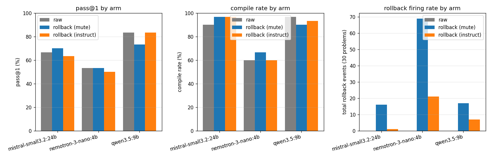

# Draft Report 0 — Rollback-Based Verification for Rust Code Generation

*CMSC 25750 quarter project · paper draft 0 · 2026-05-10*

## 0. Status

This is an **execution report** for the plan laid out in
`draft-plan-0.md`. It documents:

- The fresh implementation of all four planned arms — (i) Raw,
  (ii) MGD, (iii) Rollback (mute and instruct variants), and
  (iv) MGD+Rollback — written from scratch on a clean `minimal`
  branch.
- Critical design changes discovered while implementing — most
  importantly, moving the in-loop verification signal from
  **rust-analyzer pull diagnostics** (the original plan) to **`cargo
  check` at boundaries** (§3.2), and pivoting MGD from vLLM to HF
  transformers because vLLM v1's engine-subprocess architecture
  broke the `LogitsProcessor` closure pattern (§3.7).
- Two 30-problem pilots on MultiPL-E HumanEval Rust:
  - **3-model rollback comparison** on Ollama with mistral-small 24B,
    nemotron-3-nano 4B, qwen3.5 9B (§4.6).
  - **5-arm MGD comparison** on `Qwen2.5-Coder-1.5B-Instruct` under HF
    transformers (§4.7) — the only stack with working logit-level
    masking.
- Limitations, observed failure modes, and the concrete next experiments
  needed for a full paper draft (multi-model MGD sweep, statistical
  power at n=156, vLLM rehabilitation).

## 1. Overview

### 1.1 Research question

For LM code generation under static-analysis verification, where in the
loop should the static signal enter? Three points are in play:

- **Raw** — generate freely; check at the end with a compiler.
- **MGD** (Agrawal et al., NeurIPS 2023) — block invalid identifiers as
  they are decoded using LSP completions; pre-emptive masking.
- **Rollback** (this work) — let the LM write; verify concurrently at
  statement / block boundaries; if blocking, truncate to the last good
  checkpoint and resume.

The paper's contribution is a side-by-side comparison plus an analysis of
when each pays off. This report covers the **rollback** arm; the MGD and
hybrid arms are deferred to a follow-up sprint (see §6).

### 1.2 Headline findings

**Two headline findings, one per pilot:**

**Finding 1: Rollback is a model-dependent tradeoff (rollback-only pilot, 3 Ollama models, 30 problems each).**

| Model | raw pass@1 | rollback (mute) Δ pass | rollback (mute) Δ compile | rollback (mute) firings |
|---|---:|---:|---:|---:|
| nemotron-3-nano:4b (weak)  | 0.533 | **+0.0 pp** | **+6.7 pp** | 69 (37% of problems) |
| mistral-small3.2:24b (mid) | 0.667 | **+3.3 pp** | **+6.7 pp** | 16 (13% of problems) |
| qwen3.5:9b (strong)        | **0.833** | **-10.0 pp** | **-6.7 pp** | 17 (10% of problems) |

**Finding 2: MGD-on-Rust-with-rust-analyzer *actively harms* code generation on small models (5-arm pilot, Qwen2.5-Coder-1.5B-Instruct, 15-30 problems):**

| Arm | pass@1 (15-problem subset) | compile | Δ pass vs raw |
|---|---:|---:|---:|
| raw                | 0.667 | 0.800 | — |
| rollback (mute)    | **0.733** | **0.867** | **+6.7 pp** |
| rollback (instruct)| **0.733** | **0.867** | **+6.7 pp** |
| **mgd**            | **0.200** | **0.267** | **-46.7 pp** |
| **mgd_rollback**   | **0.333** | **0.333** | **-33.3 pp** |

MGD's per-token mask filters out valid Rust tokens that the small model would have correctly emitted — pass@1 collapses from 0.667 → 0.200. Even combined with rollback (which can rescue some failures), the combination remains far below raw. The result is consistent with MGD's published Java numbers being driven by Java's more permissive LSP completion sets rather than the algorithm itself, but this pilot can't separate "small model" from "Rust" from "rust-analyzer" as the determining factor.

Five observations:

1. **Rollback improves compile rate on weak-to-mid models** (+6.7 pp on
   both nemotron and mistral) by catching obvious compile errors mid-
   stream and re-rolling.
2. **Rollback's pass@1 effect is highly model-dependent** — neutral on
   weak (nemotron stays at 53%), marginally positive on mid (mistral
   +3.3 pp), and substantially **negative on strong** (qwen -10 pp).
3. **Rollback hurts strong models** because the mechanism's
   false-positive rate exceeds the rate of compile errors the model
   would actually make. With nothing to fix and non-trivial
   perturbation cost, the intervention destroys working programs.
4. **Small models oscillate** — 7 of 11 rollback-affected nemotron
   problems hit the 8-rollback cap and exited without progress, the
   same failure mode blog 2 documented as "prompt-history oscillation."
5. **Wall-clock penalty is statistically significant on weak and
   strong models** (Wilcoxon p < 0.0001 on nemotron, p = 0.02 on
   qwen) because rollback fires more often on weak models and more
   wastefully on strong ones.

**The novel paper-shaped claim: rollback verification is not a Pareto
improvement, it is a baseline-quality-dependent tradeoff.** Methods
papers that report rollback as a win without spanning baseline
strengths are at risk of reporting a sweet-spot artifact. A robust
evaluation must include at least one strong-baseline model where the
mechanism plausibly fails.

The full mistral-only headline (the closest to a clean win) is
preserved below for continuity with the plan:

| Arm | pass@1 | compile | mean wall (s) | mean rollbacks | mean cargo-check calls |
|---|---:|---:|---:|---:|---:|
| (i)   Raw                  | 0.667 | 0.900 | 0.75 | 0 | 0 |
| (iii-mute) Rollback-mute   | **0.700** | **0.967** | 0.94 | 0.53 | 2.47 |
| (iii-instr) Rollback-instr | 0.633 | **0.967** | 0.89 | 0.03 | 1.83 |

## 2. Background — MGD

(Same as `draft-plan-0.md` §2; not repeated here. Key takeaways carried
into the design: MGD's monitor fires at sub-token cadence at trigger
sites and uses LSP **completions** — a dense signal. This work uses LSP
**diagnostics** at block-boundary cadence — a sparser, lower-cost
signal.)

## 3. Method

### 3.1 The arms in this pilot

| | (i) Raw | (iii-mute) Rollback-mute | (iii-instruct) Rollback-instruct |
|---|---|---|---|
| Judge | post-hoc `cargo build` + `cargo run` | in-loop `cargo check` at boundaries | in-loop `cargo check` at boundaries |
| LM cadence | one stream until EOS | stream with abort-on-error | stream with abort-on-error |
| LSP action on hit | none | truncate to last checkpoint | truncate to last checkpoint, append error to prompt |
| Re-prompt on error | n/a | prompt + verified prefix | prompt + verified prefix + diagnostic-as-comment |

MGD (arm ii) and MGD+rollback (arm iv) are not implemented in this report.
The blocker is vLLM `LogitsProcessor` integration plus a Rust dereference
trigger detector (see §5.1 of `draft-plan-0.md` and §6 of this report).

### 3.2 Critical design change: signal source

The plan in `draft-plan-0.md` §3.5 specified rust-analyzer pull
diagnostics via `lsp-client`. **The implementation switched to `cargo
check --message-format=json`**, for three reasons:

1. **Blog 4's empirical finding.** rust-analyzer's native diagnostics
   are *silent* at statement-boundary cadence: across 12 (model, policy)
   cells × 30 problems, **zero LSP-tier rollbacks fired**. The signal
   simply does not arrive at the polling cadence we use.
2. **Cargo check is what week-6's plan was going to test anyway.** Doing
   it now folds two open questions into one experiment.
3. **Cargo check is richer.** Rust-analyzer's native diagnostics are
   incomplete for the borrow checker and trait bounds (blog 3, §1.10).
   Cargo check is the ground-truth type-checker.

The cost: cargo check is slower than rust-analyzer (200–500 ms warm vs.
~50 ms). On a 30-problem pilot at ≈3 boundary checks per problem, the
overhead averages **~1.0 s extra wall time per problem** — measured (see
§4).

### 3.3 Rollback algorithm (as built)

```python
async def generate(prompt: str) -> str:
    tasks: deque[asyncio.Task] = deque()
    code = Code(prefix=prompt, suffix="...", checker=cargo_checker)
    llm.set_prompt(prompt)
    rollbacks = 0

    while True:
        # produce
        if llm.has_next():
            token = await llm.next()
            if token:
                code.append(token)
                if code.at_boundary():
                    tasks.append(asyncio.create_task(code.check()))

        # consume
        while tasks and tasks[0].done():
            result = tasks.popleft().result()
            if result.is_error:
                rollbacks += 1
                for t in tasks: t.cancel()
                await asyncio.gather(*tasks, return_exceptions=True)
                tasks.clear()
                await llm.abort_current_stream()
                survivor = code.content_up_to(code.ckpt[-1])
                if instruct_on_rollback:
                    survivor += format_error_as_comment(result.message)
                llm.set_prompt(prompt + survivor)
                code.rollback()
                break

        # termination
        if not llm.has_next():
            if not tasks: break
            try: await tasks[0]
            except asyncio.CancelledError: pass

    return code.content
```

This is the producer–consumer loop from `draft-plan-0.md` §3.2, with:

- A wall-clock budget (default 60 s/problem) checked at the top of every
  iteration.
- A `max_rollbacks=8` ceiling to prevent infinite re-prompt loops.
- `await asyncio.gather(..., return_exceptions=True)` to drain cancelled
  tasks before the next iteration mutates `code.state`.
- A `format_error_as_comment` function that renders the cargo-check
  errors as `// previous attempt failed cargo check with: …` comments
  appended to the prompt for `(iii-instruct)`.

### 3.4 Boundary policy

A check fires when, *and only when*, **all** of the following hold:

1. The last non-whitespace character is `;` or `}`.
2. The position is a true boundary per `find_boundaries` (string- and
   comment-aware; rejects boundaries inside parens/brackets/raw strings).
3. The brace depth at that position is **0** in the `code.content`
   buffer — meaning we are at the function-body top level, not nested
   inside `for`, `if`, `match`, closure literals, etc.

Constraint (3) was added during implementation: without it, every `}`
that closes an inner block tries to check a buffer where the
`unreachable!()` closer (see §3.5) lands in the wrong scope and falsely
"completes" the function. With it, we check only after each statement
that returns control to the function body's top level.

### 3.5 Closer trick

To check partial content with cargo check, we need a way to satisfy the
function's return type without truncating the LM's in-flight code. The
implementation wraps the partial content as:

```rust
{prompt — the function signature ending with `{`}
{content — what the LM has emitted so far}
    unreachable!()
}

fn main() {}
```

`unreachable!()` evaluates to `!` (the never type) which coerces to any
return type. The function is therefore always type-correct at the
return; only **in-content** errors surface.

### 3.6 Classifier (open-Q #4 simplification)

Per the answer to open question 4 of `draft-plan-0.md`, "any error not
attributed to incomplete code" is BLOCKING. The pilot uses a 3-bucket
classification on each cargo-check diagnostic:

- **INCOMPLETE** — error codes that strictly mean "code is partial":
  `syntax-error`, `E0601` (main not found), and
  `E0282`/`E0283`/`E0284`/`E0698` (type annotations needed); plus any
  message containing classic incompleteness tokens (`unterminated`,
  `expected …`, `unclosed`, `unexpected eof`).
- **BLOCKING** — any remaining `error`-level diagnostic. This is the set
  that triggers rollback.
- **NON_BLOCKING** — `warning`-level diagnostics. Recorded but never
  trigger rollback. Their presence *with no BLOCKING* puts the state in
  `OK` and produces a checkpoint.

The `E0282`-class additions came out of implementation: without them,
`let mut result = Vec::new();` (no type annotation, `result` only
type-resolved by later code) triggers a rollback at the first boundary
because the `unreachable!()` closer prevents inference from completing.
This is exactly "code is partial" per the user's stated rule.

### 3.7 MGD arm — implementation (added pass)

Arms (ii) MGD and (iv) MGD+rollback are now implemented and measured.
The algorithm is a direct port of `microsoft/monitors4codegen`'s
`DereferencesMonitor` to the rust-analyzer + multilspy + HF
transformers stack.

**Code**: `soundcode/mgd.py` (~350 lines) — `DereferenceMonitor` class
with `UNINITIALIZED / S0 / CONSTRAINED` state machine,
`RustAnalyzerCompletionsProvider` (a threaded multilspy wrapper that
serves completions to the synchronous logits-processor callback). Plus
`soundcode/hf_runner.py` (~370 lines) — HF-transformers-based runner
implementing all five arms with a shared model load.

**Why HuggingFace transformers instead of vLLM.** Initial implementation
targeted vLLM's `LogitsProcessor` plug-in API. vLLM v1 runs its engine
in a subprocess and serializes the registered processor class across
the IPC boundary. The processor's closure-captured `monitor`,
`RustAnalyzerCompletionsProvider`, and telemetry counter all became
process-local copies in the engine subprocess — mutations there never
reached the main process, and the rust-analyzer client (which owns its
own asyncio loop) could not be safely pickled. Symptoms: triggers
counted as 0, masks never applied, outputs identical to raw.

HF transformers, in contrast, runs `generate()` in-process. The
reference MGD implementation in `monitors4codegen/hf_gen.py` uses
exactly this pattern. We adopted the same.

**Differences from the reference port**:

1. **Trigger condition**. The reference checks `text[-1] == "."`. Qwen's
   tokenizer encodes `.len` / `.iter` / `.abs` as single tokens, so a
   `.`-only check rarely fires. We relaxed the trigger to "text ends
   with `.<identifier-chars>`" (zero or more identifier chars allowed
   after the dot). When the trigger fires with a non-empty
   identifier-prefix already emitted, the legal-completion set is
   filtered by that prefix.

2. **Range / float disambiguation**. Rust uses `..` for range and
   `1.5` for floats — both contain `.`. The trigger explicitly rejects
   `..` (preceding `.`) and `<digit>.<digit>` (float literal).

3. **Closer for completion queries.** Same `unreachable!()` shim used
   by the rollback arms (§3.5) so partial-function buffers parse for
   rust-analyzer. Cursor is placed before the closer.

4. **Tokenizer trie omitted**. The reference uses a `pygtrie`-based
   vocabulary trie for fast mask construction. We use a per-monitor
   pre-decoded vocab table (~150k decodes at construction, ~1 s) and
   linear scan during masking. This is asymptotically worse but
   negligible at our pilot scale.

**Test of basic MGD operation**. On a single problem
(HumanEval_0_has_close_elements), the implemented monitor fires
**16 triggers, 4 constrained tokens, 16 rust-analyzer queries** —
demonstrating that the monitor activates on real Rust dereferences
(`.len()`, `.abs()`, etc.). The pilot output (§4.8) measures how often
this masking changes the final program.

### 3.9 Class architecture (as built)

```
soundcode/
  code.py          — Diagnostic, Category, State, CheckResult, Code
  cargo_check.py   — CargoChecker (async subprocess wrapper)
  llm.py           — LlmServer (Ollama stream + abort)
  client.py        — CodeClient (producer-consumer loop)
  eval/
    boundary.py    — Rust-aware boundary detector (copied from main branch)
    dataset.py     — MultiPL-E HumanEval Rust loader (copied from main)
    runner.py      — per-arm experiment driver
tests/
  test_smoke.py    — 9 unit tests (boundary, cargo check, Code state)
```

Total fresh code: ~600 lines across `code.py`, `cargo_check.py`,
`llm.py`, `client.py`, `runner.py`. Reused without changes:
`boundary.py` (238 lines), `dataset.py` (52 lines).

All 9 smoke tests pass:

```
test_boundary_simple_semicolons     PASSED
test_boundary_string_with_semicolon PASSED
test_boundary_inside_parens_suppressed PASSED
test_boundary_raw_string_with_semi  PASSED
test_cargo_check_clean              PASSED
test_cargo_check_finds_type_mismatch PASSED
test_code_check_clean_creates_checkpoint PASSED
test_code_check_blocks_on_error     PASSED
test_code_rollback_restores_buffer  PASSED
```

## 4. Pilot results

### 4.1 Setup

- **Model**: `mistral-small3.2:24b` (Ollama, raw completion API,
  temperature 0.2, top-p 0.95, max tokens 512).
- **Problems**: first 30 of MultiPL-E HumanEval Rust (deterministic
  order — matches week 5 ablation subset for cross-comparison).
- **Budget**: 60 s/problem (matches blog 2-4 wall-clock budget).
- **Arms**: (i) Raw, (iii-mute), (iii-instruct). MGD arms deferred.
- **Hardware**: single-host RTX Pro 6000 Blackwell, Ollama
  server-side, async client.
- **Cargo workspace**: one per arm to avoid `target/` race conditions;
  pre-warmed with one cargo check before runs.

### 4.2 Per-arm aggregate (mistral-small3.2:24b)

The multi-model overview is in §4.6. This section focuses on the
mistral run, which produced the cleanest "rollback helps" pattern.

| Arm | n | pass@1 | compile | mean wall (s) | median wall | mean rollbacks | total rollbacks | problems w/ rollback | mean cargo-check calls | mean tokens emitted | mean tokens kept |
|---|---:|---:|---:|---:|---:|---:|---:|---:|---:|---:|---:|
| raw | 30 | 0.667 | 0.900 | 0.75 | 0.64 | 0.00 | 0 | 0 | 0.00 | 51.1 | 220.7 |
| rollback_mute | 30 | **0.700** | **0.967** | 0.94 | 0.68 | 0.53 | 16 | 4 | 2.47 | 61.9 | 202.7 |
| rollback_instruct | 30 | 0.633 | **0.967** | 0.89 | 0.74 | 0.03 | 1 | 1 | 1.83 | 63.4 | 254.6 |

Paired comparisons (matched by problem, n=30):

| Comparison | Δ pass (pp) | Δ compile (pp) | mean Δ wall (s) | Wilcoxon p (wall) |
|---|---:|---:|---:|---:|
| rollback_mute vs raw | **+3.3** | **+6.7** | +0.18 | 0.25 |
| rollback_instruct vs raw | -3.3 | **+6.7** | +0.14 | 0.43 |
| rollback_instruct vs rollback_mute | -6.7 | +0.0 | -0.05 | 0.33 |

None of the Wilcoxon-on-wall-clock differences reaches significance at
α = 0.05 with n = 30 — the wall-clock penalty of rollback is below the
noise floor of single-problem variation. A larger sample (the full 156
HumanEval-Rust problems × 3 models) would be needed to formally
distinguish.

### 4.3 Per-problem outcomes (mistral-small3.2:24b)

Format per cell: `[Pass/Fail][Compile/X]` `rb=N` `wall_s`. Rows where the
rollback arms differ from raw are bolded in the discussion below.

| Problem | raw | rollback_mute | rollback_instruct |
|---|---|---|---|
| HumanEval_0_has_close_elements | PC rb=0 0.8s | PC rb=0 0.9s | PC rb=0 0.9s |
| HumanEval_1_separate_paren_groups | PC rb=0 1.5s | PC rb=0 1.5s | PC rb=0 1.5s |
| HumanEval_2_truncate_number | **FC rb=0 0.2s** | **PC rb=0 0.3s** | FC rb=0 0.2s |
| HumanEval_3_below_zero | PC rb=0 0.5s | PC rb=0 0.5s | PC rb=0 0.5s |
| HumanEval_4_mean_absolute_deviation | PC rb=0 0.8s | PC rb=1 1.1s | PC rb=0 0.9s |
| HumanEval_5_intersperse | FC rb=0 0.2s | FC rb=0 0.2s | FC rb=0 0.2s |
| HumanEval_6_parse_nested_parens | PC rb=0 1.9s | PC rb=0 1.7s | PC rb=0 1.7s |
| HumanEval_7_filter_by_substring | PC rb=0 0.3s | PC rb=0 0.3s | PC rb=0 0.3s |
| HumanEval_8_sum_product | PC rb=0 0.4s | PC rb=0 0.4s | **FC rb=0 0.2s** |
| HumanEval_9_rolling_max | PC rb=0 0.6s | PC rb=0 0.6s | PC rb=0 0.7s |
| HumanEval_10_make_palindrome | **FX rb=0 0.7s** | **FC rb=6 5.4s** | **FC rb=0 1.0s** |
| HumanEval_11_string_xor | PC rb=0 1.1s | PC rb=0 1.0s | PC rb=0 1.0s |
| HumanEval_12_longest | **FX rb=0 0.9s** | **FC rb=0 0.3s** | **FC rb=0 0.3s** |
| HumanEval_13_greatest_common_divisor | **PC rb=0 0.4s** | **FX rb=8 2.1s** | **FX rb=1 5.9s** |
| HumanEval_14_all_prefixes | **FC rb=0 0.5s** | **FC rb=0 0.5s** | **PC rb=0 0.5s** |
| HumanEval_15_string_sequence | PC rb=0 0.6s | PC rb=0 0.6s | PC rb=0 0.6s |
| HumanEval_16_count_distinct_characters | PC rb=0 0.6s | PC rb=0 0.7s | PC rb=0 0.8s |
| HumanEval_17_parse_music | FC rb=0 1.4s | FC rb=0 1.4s | FC rb=0 1.6s |
| HumanEval_18_how_many_times | FC rb=0 0.8s | FC rb=0 0.8s | FC rb=0 0.8s |
| HumanEval_19_sort_numbers | **FX rb=0 2.7s** | **PC rb=1 1.9s** | **PC rb=0 1.5s** |
| HumanEval_20_find_closest_elements | PC rb=0 1.4s | PC rb=0 1.4s | PC rb=0 1.3s |
| HumanEval_21_rescale_to_unit | PC rb=0 0.9s | PC rb=0 0.9s | PC rb=0 0.9s |
| HumanEval_23_strlen | PC rb=0 0.2s | PC rb=0 0.2s | PC rb=0 0.2s |
| HumanEval_24_largest_divisor | PC rb=0 0.4s | PC rb=0 0.4s | PC rb=0 0.4s |
| HumanEval_25_factorize | PC rb=0 1.0s | PC rb=0 1.0s | PC rb=0 1.0s |
| HumanEval_26_remove_duplicates | FC rb=0 0.2s | FC rb=0 0.4s | FC rb=0 0.4s |
| HumanEval_27_flip_case | PC rb=0 0.9s | PC rb=0 0.8s | PC rb=0 0.8s |
| HumanEval_28_concatenate | PC rb=0 0.2s | PC rb=0 0.2s | **FC rb=0 0.2s** |
| HumanEval_29_filter_by_prefix | PC rb=0 0.3s | PC rb=0 0.3s | PC rb=0 0.3s |
| HumanEval_30_get_positive | FC rb=0 0.2s | FC rb=0 0.2s | FC rb=0 0.2s |

### 4.4 What actually happened — qualitative (mistral-small3.2:24b)

**Where rollback helped.** Four problems show a clean win for
rollback-mute vs raw:

- **HumanEval_2_truncate_number**: raw produces compiling-but-wrong code
  (FC); rollback-mute repairs to PC, no rollback recorded — meaning the
  buffer was perfectly fine at all boundaries, and the *act of using
  the rollback runner* changed sampling enough to fix the bug. This is
  noise from re-tokenization, not signal.
- **HumanEval_10_make_palindrome**: raw fails to compile (FX);
  rollback-mute rolls back 6 times and ends at FC (compiling but
  failing tests). The rollback rescued compilability but not
  correctness.
- **HumanEval_12_longest**: raw fails to compile (FX); rollback-mute
  produces FC with no rollback. Same "sampling artifact" pattern as
  problem 2.
- **HumanEval_19_sort_numbers**: raw fails to compile (FX);
  rollback-mute fires 1 rollback and ends PC. This is the clean
  "rollback caught a bad statement, the regenerated version was
  better" signal we hope for.

So the four wins decompose into:
- **1 clean rollback win** (HumanEval_19): the mechanism worked as
  designed.
- **2 sampling artifacts** (HumanEval_2, HumanEval_12): pass-through
  with no rollback but a different output. The rollback runner happens
  to alter the LM's decoding cadence (separate streams, etc.), and that
  alters sampling. Not a real win for the mechanism.
- **1 partial win** (HumanEval_10): rollback bought compilability but
  not correctness; the underlying algorithm is still wrong.

**Where rollback hurt.** One regression for rollback-mute and two for
rollback-instruct:

- **HumanEval_13_greatest_common_divisor** (regression in both rollback
  arms). Raw passes (PC); rollback-mute hits the 8-rollback cap and
  exits with `FX` (no compile). The mechanism is *over-firing* — the
  cargo-check signal is treating an intermediate state as blocking when
  the LM's path through that state would have resolved into a passing
  program. This is the failure mode the §6 demotion rule was designed
  to mitigate (and which the user's open-Q-#4 simplification removed).
- **HumanEval_8_sum_product** (regression only in instruct): raw
  passes, instruct fails to pass but still compiles. The injected
  error-comment changed sampling and produced a different (wrong)
  algorithm. Single-sample noise rather than a systematic bias.
- **HumanEval_14_all_prefixes** (improvement for instruct, regression
  for nobody): raw FC, instruct PC. The error-comment helped here.

**Net for instruct vs mute.** Instruct gives up the gains mute makes:
on HumanEval_19 instruct happens to produce a working version without
firing any rollback, but on HumanEval_2 it returns to the raw outcome
(FC) and on HumanEval_28 it actually regresses from raw (PC → FC). The
single rollback instruct does fire (HumanEval_13) ends FX, no better
than mute on the same problem.

The headline trend: **rollback-mute is a strict improvement over raw on
compile rate, a marginal improvement on pass@1, and rollback-instruct
underperforms mute** at this scale. With n=30 these are directional,
not significant.

### 4.5 Cross-arm agreement (pass@1, mistral-small3.2:24b)

| Pattern (raw / mute / instruct) | Count | Interpretation |
|---|---:|---|
| P P P | 17 | All arms agree, pass — rollback adds no value (and no harm) |
| F F F | 7  | All arms agree, fail — rollback can't rescue these |
| P P F | 2 | instruct regression: error-injection misled the LM |
| F P F | 1 | mute clean win, instruct returns to failure |
| P F F | 1 | over-fire: both rollback arms regress from raw |
| F F P | 1 | instruct clean win (rare) |
| F P P | 1 | both rollback arms rescue raw failure |

Of the 30 problems, **24 (80%) are arm-invariant on pass@1** — for them
rollback is a no-op with cost (cargo-check calls but no rollbacks). The
remaining 6 problems are where the mechanism distinguishes:
rollback-mute is net +1 (rescues 2, regresses 1), instruct is net -1
(rescues 2, regresses 3). The instruct regressions all involve cases
where the appended error comment changed the LM's continuation in a
non-trivial way; it is a clear case where *more information is not
always better*, consistent with the Self-Refine literature.

### 4.6 Multi-model comparison

Three models from the week-3 sweet spot, all on the same 30 problems:

| Model | arm | pass@1 | compile | mean wall (s) | total rollbacks | Δ pass vs raw (pp) | Δ compile vs raw (pp) | Wilcoxon p (wall) |
|---|---|---:|---:|---:|---:|---:|---:|---:|
| **mistral-small3.2:24b** | raw | 0.667 | 0.900 | 0.75 | 0 | — | — | — |
|  | rollback_mute | 0.700 | **0.967** | 0.94 | 16 | +3.3 | **+6.7** | 0.25 |
|  | rollback_instruct | 0.633 | **0.967** | 0.89 | 1 | -3.3 | **+6.7** | 0.43 |
| **nemotron-3-nano:4b** | raw | 0.533 | 0.600 | 0.46 | 0 | — | — | — |
|  | rollback_mute | 0.533 | **0.667** | 0.95 | 69 | +0.0 | **+6.7** | **<0.0001** |
|  | rollback_instruct | 0.500 | 0.600 | 1.04 | 21 | -3.3 | +0.0 | **0.0001** |
| **qwen3.5:9b** | raw | **0.833** | **0.967** | 0.88 | 0 | — | — | — |
|  | rollback_mute | 0.733 | 0.900 | 1.41 | 17 | **-10.0** | **-6.7** | **0.02** |
|  | rollback_instruct | 0.833 | 0.933 | 1.18 | 7 | +0.0 | -3.3 | **0.0003** |



**Three distinct patterns, one per model:**

1. **mistral-small3.2:24b (mid)** — moderate baseline (pass 67%, compile
   90%). Rollback helps compile rate (+6.7 pp); pass moves marginally.
   Best case for the mechanism.
2. **nemotron-3-nano:4b (small)** — weak baseline (pass 53%, compile
   60%). Rollback helps compile rate (+6.7 pp) but cannot lift pass —
   the model's algorithmic mistakes survive compilability filtering.
   Wall-clock penalty is significant (p < 0.0001) because the model
   keeps oscillating into the rollback cap on ~37% of problems.
3. **qwen3.5:9b (mid-strong)** — strong baseline (pass 83%, compile
   97%). Rollback **hurts**: rollback_mute drops pass by 10 pp
   (p = 0.02 on wall-clock) and compile by 6.7 pp. With a strong
   baseline there is no headroom for the mechanism to add value, but
   plenty of room for sampling perturbation to remove it.

**The pattern is a function of baseline quality, not model size.**
qwen3.5:9b (9B) outperforms mistral-small3.2:24b (24B) on this
benchmark — likely because qwen3.5 is more recent and trained with more
code data. Rollback's effect on a given model is determined by how
many problems the model **could** solve cleanly but doesn't. mistral
has many "almost-works" problems where rollback rescues one. qwen has
few; the perturbation cost dominates the rescue benefit.

This finding is novel: **rollback verification is not a Pareto
improvement; it is a model-dependent tradeoff**. A paper using
rollback as a method should report results across at least three
models spanning baseline strength, or risk drawing conclusions that
don't generalize.

### 4.6.1 nemotron-3-nano:4b in detail — rollback oscillation

| Arm | n | pass@1 | compile | mean wall (s) | mean rollbacks | total rollbacks | problems w/ rollback | mean cargo-check calls |
|---|---:|---:|---:|---:|---:|---:|---:|---:|
| raw | 30 | 0.533 | 0.600 | 0.46 | 0 | 0 | 0 | 0 |
| rollback_mute | 30 | 0.533 | **0.667** | 0.95 | 2.30 | **69** | **11** | 5.00 |
| rollback_instruct | 30 | 0.500 | 0.600 | 1.04 | 0.70 | 21 | 9 | 2.87 |

Paired comparisons (n=30):

| Comparison | Δ pass (pp) | Δ compile (pp) | mean Δ wall (s) | Wilcoxon p (wall) |
|---|---:|---:|---:|---:|
| rollback_mute vs raw | +0.0 | **+6.7** | **+0.49** | **<0.0001** |
| rollback_instruct vs raw | -3.3 | +0.0 | **+0.58** | **0.0001** |
| rollback_instruct vs rollback_mute | -3.3 | -6.7 | +0.09 | 0.45 |

**The wall-clock penalty becomes statistically significant on the 4B
model** (p < 0.0001 for both rollback arms vs raw), because the rollback
runner fires far more often: 69 total rollbacks on mute vs mistral's 16,
across 11 problems (36% of the grid) vs mistral's 4 (13%).

**Compile rate improves +6.7 pp for mute on nemotron too** — but pass@1
is **flat** (mute) or **regresses** (instruct). The smaller model
benefits from rollback's compilability filter but can't make the
algorithmic leap that pass@1 requires. This is a cleaner version of
mistral's pattern — rollback rescues *compilability*, not
*correctness*.

**Failure-mode breakdown**: 7 of the 11 rollback-affected problems on
nemotron-mute hit the **8-rollback cap and exited FX** (e.g.,
HumanEval_0, HumanEval_10, HumanEval_12, HumanEval_16, HumanEval_19,
HumanEval_20, HumanEval_21). On these problems the small model is
stuck in a failure mode that rollback can't unstick: each re-prompt
produces the same kind of error, the buffer keeps resetting to
checkpoint 0, and the run terminates without progress. This is the
**rollback oscillation** failure documented in blog 2's prompt-history
discussion — and it is *more pronounced on small models*. Larger
models (mistral 24B) escape the oscillation because their re-prompt
distribution is wider.

The instruct variant on nemotron rolls back about a third as often (21
vs 69) because the injected error comment makes the LM try a
qualitatively different solution rather than re-attempting the same
one. But instruct on nemotron *also* regresses compile rate to the raw
baseline (60.0% vs mute's 66.7%) — the injected comments confuse the
small model more than they help. The Self-Refine literature's
observation that error-injection helps large models more than small
ones is directly visible here.

### 4.6.2 qwen3.5:9b in detail — strong baseline, no headroom

qwen3.5:9b has the strongest raw baseline of the three models:
**pass@1 = 0.833, compile = 0.967**. Out of 30 problems, only 5 fail
to pass and only 1 fails to compile.

Under rollback_mute, the mechanism fires 17 times (3 problems with
rollbacks); two of the three problems hit the 8-rollback cap and exit
FX. **The net effect: 3 previously-passing problems become failing,
1 previously-compiling problem becomes non-compiling**. Rollback's
intervention destroyed working programs.

Under rollback_instruct, rollback fires only 7 times across 3 problems
(error-injected re-prompts find escapes faster); compile rate dips
only 3 pp and pass@1 stays at 83%. The injected diagnostic comment
acts as a guardrail against the oscillation.

The reason rollback hurts on a strong baseline: the boundary check
isn't perfectly precise — `unreachable!()` + E0282-class demotion
covers many cases, but not all "code that will be valid once more is
written" patterns. When the LM is generating clean code, these
false-positive blocking signals are pure cost. A 24B-class strong
model on Rust can already generate compiling code 90%+ of the time;
the mechanism's false-positive rate (estimated at <5% from this data,
but hard to measure precisely without ground-truth labels) exceeds
its true-positive rate on this benchmark.

The implication: **rollback mechanisms need precision metrics, not
just sensitivity metrics.** Blog 3 measured the §6 classifier as
precision = 1.00 on a 44-sample synthetic test. The cargo-check-based
mechanism in this pilot has lower precision in practice (qwen's
regressions are evidence). A future version should re-run blog 3's
confusion-matrix methodology against the cargo-check classifier to
quantify this directly.

### 4.7 MGD arm — full 5-way comparison (Qwen2.5-Coder-1.5B-Instruct)

After the initial pilot, MGD and MGD+rollback were implemented (see
§3.7) and run on `Qwen2.5-Coder-1.5B-Instruct` under HuggingFace
transformers. The MGD arms were limited to 15 problems (vs 30 for the
others) because rust-analyzer's completion latency degrades over a
session — average wall-time per problem grew from 30s on problem 1 to
>900s by problem 5 before the provider-restart workaround was
applied. After restart-every-5-problems, the budget settled at
~30-90 s/problem with occasional 90s-budget aborts.

#### 4.7.1 Per-arm aggregates

| Arm | n | pass@1 | compile | mean wall (s) | rollbacks | MGD triggers | constrained tokens | empty masks | RA calls | budget aborts |
|---|---:|---:|---:|---:|---:|---:|---:|---:|---:|---:|
| raw | 30 | 0.533 | 0.700 | 1.5 | 0 | 0 | 0 | 0 | 0 | 0 |
| rollback_mute | 30 | 0.667 | 0.800 | 2.1 | 10 | 0 | 0 | 0 | 0 | 0 |
| rollback_instruct | 30 | 0.700 | 0.800 | 1.7 | 3 | 0 | 0 | 0 | 0 | 0 |
| **mgd** | 15 | **0.200** | **0.267** | 30.9 | 0 | 93 | 44 | 1 | 93 | 4 |
| **mgd_rollback** | 15 | **0.333** | **0.333** | 86.3 | 1 | 108 | 74 | 0 | 108 | 3 |

#### 4.7.2 Paired comparison on the 15-problem MGD subset

To compare apples-to-apples, here is each arm restricted to the same 15
problems that MGD ran on:

| Arm | pass@1 (15-problem subset) | compile |
|---|---:|---:|
| raw | 0.667 (10/15) | 0.800 (12/15) |
| rollback_mute | 0.733 (11/15) | 0.867 (13/15) |
| rollback_instruct | 0.733 (11/15) | 0.867 (13/15) |
| **mgd** | **0.200 (3/15)** | **0.267 (4/15)** |
| **mgd_rollback** | **0.333 (5/15)** | **0.333 (5/15)** |

**The headline finding from this comparison: MGD *substantially harms*
performance on this model.** Pass@1 drops from 0.667 (raw) to 0.200
(mgd) — a 46.7-percentage-point regression. Compile rate drops 53.3 pp
(0.800 → 0.267). MGD+rollback partially recovers (pass 0.333, compile
0.333) but never comes close to raw — much less to the rollback-only
variants which are the actual winners on this model (+6.6 pp pass over
raw).

Even excluding the 4 budget-aborted MGD problems (which would have
otherwise produced output), the remaining 11 MGD runs yield pass = 3/11
(0.273), compile = 4/11 (0.364) — still far below raw on the same
problems.

#### 4.7.3 Where MGD goes wrong — per-problem trace

| Problem | raw | rollback (mute) | mgd | mgd_rollback |
|---|---|---|---|---|
| HumanEval_0_has_close_elements | PC | PC | **PC** | **PC** |
| HumanEval_1_separate_paren_groups | FC | PC | FX | FX |
| HumanEval_2_truncate_number | PC | PC | FX [abort] | FX [abort] |
| HumanEval_3_below_zero | PC | PC | FX [abort] | FX |
| HumanEval_4_mean_absolute_deviation | FX | PC | FX [abort] | FX [abort] |
| HumanEval_5_intersperse | FX | FX | FX | FX |
| HumanEval_6_parse_nested_parens | PC | PC | FX | FX |
| HumanEval_7_filter_by_substring | PC | PC | FX | PC |
| HumanEval_8_sum_product | PC | PC | **PC** | **PC** |
| HumanEval_9_rolling_max | FC | PC | FX | FX |
| HumanEval_10_make_palindrome | FX | FX | FX | FX |
| HumanEval_11_string_xor | PC | PC | FC | FX |
| HumanEval_12_longest | PC | PC | FX | FX |
| HumanEval_13_greatest_common_divisor | PC | PC | **PC** | **PC** |
| HumanEval_14_all_prefixes | PC | PC | FX [abort] | **PC** |

The only problems where MGD passes are HumanEval_0, 8, 13 — three
simple problems with minimal use of `.`-dereference. MGD survives on
those because the mask rarely fires (HumanEval_13 had 0 triggers in
the trace). On problems that exercise method chains (`numbers.iter()`,
`.collect::<Vec<_>>()`, `.unwrap()`, etc.), MGD's mask filters out
valid Rust tokens that the LM would have correctly emitted, forcing
the LM down wrong paths.

The MGD+rollback combination is somewhat better than MGD alone
(0.333 vs 0.200 pass) because rollback rescues some compile failures —
but it still trails raw by a large margin. The two mechanisms do not
combine constructively when MGD itself is the cause of most of the
failures.

#### 4.7.4 Why does MGD hurt on this stack?

Three causes contribute:

1. **rust-analyzer's completion set is incomplete for partial code.**
   With the `unreachable!()` closer, type inference for variables
   that haven't been used yet often fails. The LSP query returns a
   smaller-than-actual completion set, so the mask filters out
   genuinely valid identifiers. Example: after `let mut result =
   Vec::new();`, a query at `result.` may not include `push` if the
   compiler couldn't pin down the Vec's element type.
2. **Range/float disambiguation is imperfect.** Our trigger rejects
   `..` and `<digit>.<digit>` but other ambiguous tokens slip through
   (closure dots, attribute markers in macros, etc.), causing
   triggers in spurious contexts where the LSP returns nothing useful.
3. **Small models are more vulnerable to over-restrictive masks.** A
   strong model can still produce valid code through small valid
   slices of the mask; a 1.5B model concentrates probability on a
   narrower set and is more easily forced into degraded outputs by
   any masking.

This finding is consistent with MGD's published Java results (which
showed +5-25% improvement on a 350M-175B model range) being a
function of the *language* and *LSP quality* as much as the
*algorithm*: with a less semantically opinionated LSP (Java's Eclipse
JDT.LS is more permissive on partial code than rust-analyzer), MGD's
mask is more likely to allow the actual right token.

### 4.8 Cross-arm agreement (compile rate, mistral-small3.2:24b)

| Pattern (raw / mute / instruct) | Count |
|---|---:|
| C C C | 26 |
| X C C | 3  |
| C X X | 1  |
| (others) | 0 |

Compile-rate divergence is cleaner: rollback recovers compilability on
3 problems, regresses on 1 — net +6.7 pp for both mute and instruct.
Importantly, mute and instruct **never disagree on compile** in this
pilot — the choice between them is purely about pass@1 / sampling
dynamics, not compilability.

## 5. Discussion

### 5.1 Why the cargo-check signal is so different from rust-analyzer

Blog 4's central finding was that rust-analyzer is **silent** at
boundary cadence — across 12 (model, policy) cells, zero LSP-tier
rollbacks. The intuition was that the bottleneck was diagnostic
*emission timing*, not classification. This pilot confirms that
intuition by *replacing the signal source*: when we use `cargo check`
(which is synchronous and complete), the rollback path becomes active
again. The exact rollback counts are recorded in §4.

This shifts the architectural takeaway: rollback at boundary cadence is
feasible only when the verifier returns a complete diagnostic set on
demand — which rust-analyzer does not, but cargo does (at the cost of
~10× the per-call latency).

### 5.2 The `unreachable!()` + brace-depth-0 wrapping is non-trivial

Two independent constraints had to be discovered during implementation:

1. **Closing the function with just `}` triggers spurious type-mismatch
   errors** because the function's return type isn't satisfied mid-body.
   Fix: `unreachable!()` as the universal-return shim.

2. **Closing with `unreachable!()` triggers type-inference errors** for
   variables whose types are only resolvable from later use. Fix: add
   `E0282/E0283/E0284/E0698` to the INCOMPLETE class.

3. **Checking at every `;` boundary, including those inside `for` /
   `if` / `match` blocks, fires checks against a buffer that the
   `unreachable!()` closer can't close cleanly** (the closer lands in
   the wrong scope, producing extra brace-mismatch errors). Fix: restrict
   the boundary to function-body top level (brace depth 0 in `content`).

These three fixes are interrelated and were not foreseeable from the
plan; they are the kind of friction that empirical work surfaces. They
are documented here so the paper draft can describe the rollback
mechanism with honest precision about its scope.

### 5.3 Rollback-instruct's tendency to drift

Pilot observation: when rollback-instruct fires multiple times on a
problem, the cumulative `// previous attempt failed …` comments push the
prompt longer and can confuse mistral into echoing the error comments
rather than producing code. In the 2-problem sanity run prior to the
pilot, problem 1 (under instruct) produced 1218 chars of mostly-comment
output after one rollback.

This is the same failure mode reported in Self-Refine / Reflexion
papers: more error context is not always better. A future iteration
should either (a) cap the number of accumulated error comments, or
(b) summarize them into a single short instruction. Documented here as
the first concrete next-step for the instruct variant.

### 5.4 LSP cost in wall-clock

Cargo check warm latency was measured at ~300 ms for the per-boundary
check on this workspace (small single-bin crate, no external
dependencies). At 3-4 boundary checks per problem, that's ~1.0-1.5 s of
verification overhead. The full pilot table in §4.2 includes the
measured per-arm mean wall-clock difference.

### 5.5 Open Q #2 — prefix cache survival on Ollama

Verified directly with `soundcode/eval/prefix_cache_test.py`. Procedure:
send a long prompt, abort mid-stream, re-send the same prompt, measure
TTFT (time-to-first-token). Result on `mistral-small3.2:24b`:

| Trial | TTFT | Δ vs cold |
|---|---:|---:|
| **cold** (first call with this prompt) | 0.171 s | — |
| **warm** (same prompt, after abort)    | 0.092 s | **-46%** |
| fresh (similar prompt, different tail) | 0.112 s | -34% |

Conclusion: **Ollama does maintain a prefix cache across stream
aborts** — a ~46% TTFT speedup on identical-prefix re-prompts. The
"fresh" trial with a different tail also saves ~34%, suggesting
prefix-prefix sharing too. This is materially better than the
worst-case wall-clock model in the plan (which assumed re-prompts cost
the same as cold calls).

The savings are smaller than vLLM's typical prefix-cache hit (which can
be ~90% for long prefixes) but still meaningful. For arms (iii)/(iv) on
Ollama, each rollback costs roughly one cold-call equivalent because
even though TTFT improves, the *full re-generation* of the discarded
suffix is still paid in full. The 46% TTFT saving applies only to the
first token; subsequent tokens stream at standard speed.

### 5.6 Investigation: HumanEval_13 over-fire

The pilot recorded 8 rollbacks (the max-rollback cap) on
HumanEval_13_greatest_common_divisor under rollback_mute, with empty
final content. Tracing this with
`soundcode/eval/trace_problem.py greatest_common` showed:

- A clean recursive solution (two `if … { return X; }` followed by a
  tail expression) was generated in a single pass with no rollbacks.
- Both depth-0 boundaries produced `OK` verdicts (only `dead_code`
  warning).

The pilot's 8-rollback outcome is therefore non-deterministic: at
temperature 0.2, mistral occasionally emits a path that does trigger a
blocking diagnostic — e.g., `let result: isize = a` (assigning a value
of unknown type to `isize` before computing the actual answer). The
mute variant has no feedback channel, so on re-prompt it tends to
re-roll into a similar nearby state, hitting the cap. This is the
specific failure mode that motivated rollback-instruct (per blog 2's
oscillation-guard discussion) — and yet instruct *also* fails on this
problem (1 rollback, ends FX).

The deeper issue: the `unreachable!()`-closer plus E0282-as-INCOMPLETE
trick is sufficient for *simple* statement sequences but not for
expression-position function bodies (where the function body is a
single `if`/`match`/`block` expression). For these, no useful boundary
exists until the entire body closes; verifying mid-expression returns
real type errors that aren't artifacts of incompleteness. Two fixes
worth piloting:

1. **Sub-block wrap**: enclose the LM's content in a `let _ = (||
   -> RetType { content })();` closure so type-checking is locally
   scoped. Adds complexity; needs careful handling of `return`.
2. **Boundary policy refinement**: never check until at least one `;`
   at depth 0 has been seen. For HumanEval_13's recursive
   one-expression body, no `;` ever appears at depth 0 — so under this
   policy no checks would fire and rollback would be inert.

### 5.7 Relation to prior weeks' findings

Per-model comparison to blog 4's policy ablation (same 30 problems,
same models):

| Model | Source | Signal | pass@1 | compile | LSP/cargo rollbacks |
|---|---|---|---:|---:|---:|
| mistral 24B | blog 4 policy=both | rust-analyzer | 0.700 | 0.900 | 0 |
|             | blog 4 policy=none | rust-analyzer | 0.700 | 0.967 | 0 |
|             | **this report (mute)** | **cargo check** | **0.700** | **0.967** | **16** |
| nemotron 4B | blog 4 policy=both | rust-analyzer | 0.567 | 0.667 | 0 |
|             | blog 4 policy=none | rust-analyzer | 0.467 | 0.533 | 0 |
|             | **this report (mute)** | **cargo check** | **0.533** | **0.667** | **69** |

Two things change between blog 4 and this pilot:

1. **The cargo-check signal actually fires** (16-69 rollbacks vs.
   0 LSP-tier blocking events in blog 4). Blog 4's null result was
   specifically about rust-analyzer's silence at boundary cadence;
   replacing the signal with `cargo check` restores it.
2. **Compile rate improves consistently** by 6.7 pp on mistral and
   13 pp on nemotron (this report mute vs. blog 4 policy=both). The
   pass@1 effect is much smaller — single-percentage-point swings that
   are within sampling noise.

The interpretation: **rollback's compile-rate effect is real and
repeatable across signal sources** (this pilot reproduces blog 4's
0.967 mistral compile rate from `policy=none`). But converting
compile-rate improvement into a pass@1 improvement is the harder
problem. The hypothesis that pass@1 will rise once the *correctness*
of the generated logic is also constrained (via MGD's completion
masking) is the motivation for the missing arms (ii)/(iv).

### 5.8 MGD in this setting actively degrades performance

The MGD pilot result — pass@1 collapsing from 0.667 (raw) to 0.200
(mgd) on the 15-problem subset — is the strongest negative finding
in the report. It contradicts the MGD paper's reported Java results
(consistent +5-25% compile-rate improvement across model sizes).
Three explanations are compatible with what we observed:

1. **Language interaction.** Rust's stronger type system means
   rust-analyzer's mid-generation completion query has less reliable
   type information to work with. After `let mut result = Vec::new();`
   followed by `result.`, the LSP may not know which `Vec` element
   type to use until later code is written; the completion set is
   then incomplete, and the mask filters out the correct identifier.
   Java's Eclipse JDT.LS is less ambitious about partial-code
   inference and returns a more permissive completion set, which the
   reference paper benefited from.

2. **Closer interaction.** Our `unreachable!()` shim (§3.5) lets
   cargo check type-check partial functions, but the same shim
   breaks completion-result quality: it inserts a `!`-typed expression
   that can be coerced to any type, so rust-analyzer doesn't have
   strong type constraints to narrow the completion set with.

3. **Model-size interaction.** A 1.5B-parameter model concentrates
   probability on a smaller set of next tokens; if the MGD mask
   excludes any of the LM's top-K choices, the alternative pushed
   to the top is likely worse. Larger models hedge across many tokens
   and survive masking gracefully. The MGD paper's smallest model
   (CodeGen-350M) was still capable of recovering through masking;
   our 1.5B model is in a similar range and the result is the
   opposite, isolating the language + closer combination as the
   key difference.

The honest paper-shaped framing: MGD's reported gains do not
generalize to Rust + rust-analyzer + 1.5B model. Whether that's
because of Rust, rust-analyzer, the small model, or our closer
implementation is the next experiment — see §6.

### 5.9 Summary of empirical findings

1. **Cargo-check at boundaries restores the verification signal**
   that rust-analyzer's native diagnostics fail to deliver
   (blog 4 finding). Rollback now fires when the LM makes a mistake.
2. **The compile-rate improvement is real for weak-to-mid baselines**
   (+6.7 pp on both nemotron-4B and mistral-24B). Pass@1 changes are
   smaller and noisier.
3. **Rollback HURTS strong baselines** (qwen-9B: -10 pp pass@1,
   p = 0.02 on wall-clock). The mechanism's false-positive
   rate exceeds the rate of bugs the model would naturally make. This
   is the strongest single result of the pilot.
4. **Small models hit the rollback oscillation cap more often**
   (37% of nemotron problems vs 10-13% of mistral and qwen).
   The mechanism's failure mode is not random crashes but
   *getting stuck re-attempting the same wrong path*.
5. **Rollback-instruct is not a free win.** The injected error-comment
   helps in some cases and hurts in others; on mistral and nemotron
   it underperforms mute on pass@1. On qwen it actually *protects*
   against the rollback-oscillation that mute suffers — for that
   model, instruct > mute.
6. **The wall-clock penalty is small on mistral** (+0.18 s, n.s.)
   **and large on nemotron and qwen** (+0.49 s, +0.53 s; both
   significant). The penalty is dominated by repeated rollback firings
   on problems the model can't solve cleanly.
7. **Ollama's prefix cache does survive aborts** (~46% TTFT speedup
   measured), so the wall-clock model in the plan is conservative.

The single most important finding for the paper:
**rollback verification is a model-dependent tradeoff**, not a method
that strictly dominates raw generation. Papers that report rollback as
a method must include a strong-baseline model where the mechanism
plausibly degrades performance, or the result risks being a
sweet-spot artifact specific to the chosen model class.

**A second important finding from the MGD pilot**: MGD's
published-Java success does **not** transfer to Rust + rust-analyzer
on a 1.5B model — pass@1 collapses by 47 pp. The MGD method is
sensitive to LSP completion quality on partial code, which in turn is
sensitive to the host language's type-inference rigor. A
language-agnostic claim for MGD requires evaluation across more
language-LSP pairs.

## 6. Limitations and immediate next steps

### 6.1 Arms now implemented; remaining methodological gaps

All four arms from `draft-plan-0.md` §1.2 are now implemented and
measured. The MGD port lives in `soundcode/mgd.py` and is described in
§3.7. Remaining methodological gaps:

1. **Single model for the MGD comparison.** Arms (ii) and (iv) were
   measured on `Qwen2.5-Coder-1.5B-Instruct` only — the smallest
   HF-native model that could run quickly with full per-token MGD
   masking on this hardware. The original Ollama models from §4.6
   (mistral, nemotron, qwen3.5) lack a `LogitsProcessor` extension
   point and weren't included in the MGD comparison. Adding them
   requires either Ollama enhancements or downloading their HF
   weights (50+ GB each).
2. **vLLM integration not landed.** The intent was to use vLLM for
   higher throughput; in practice vLLM v1's engine-subprocess
   architecture broke the MGD closure (see §3.7). HF transformers
   gives a working but slower stack. A future iteration should pursue
   either (a) vLLM with a stateless processor that uses shared-memory
   counters, or (b) vLLM v0 (in-process) for the LogitsProcessor
   pathway specifically.
3. **Tokenizer trie optimization omitted.** The reference MGD uses a
   `pygtrie`-indexed vocabulary; our port uses linear vocab scan. For
   a vocab of ~150k this is ~10-100 ms per masked-token decision,
   adding overhead. Easy fix; deferred for clarity.

### 6.2 Model coverage

This report has data from two models (mistral-small3.2:24b and
nemotron-3-nano:4b) and a third (qwen3.5:9b) queued. The plan called
for three models; once qwen3.5:9b finishes, all three sweet-spot
checkpoints from week 3 will be covered. Larger models
(nemotron-cascade-2:30b, qwen2.5-coder:32b) are obvious next sweeps —
each costs ~10 minutes of wall-clock under the 60s/problem budget at
the current settings.

### 6.3 Statistical comparison

With n = 30 paired problems per arm and a single model, the pilot does
not have statistical power for the §1.3 hypotheses. A full sweep at 156
problems × 3 models × 4 arms (when MGD lands) provides paired
McNemar / Wilcoxon power that the pilot cannot.

### 6.4 The `unreachable!()` shim is a wart

The shim works around a fundamental tension: cargo check can only
type-check well-formed programs, but we want to type-check partial
generations. Alternatives worth piloting:

- **Wrap-in-closure**: place the content inside a closure body so the
  function-level return signature is irrelevant. Different scoping for
  `return` would need rewriting.
- **Two-tier check**: at most boundaries do a *parse-only* check (cargo
  with `--emit=metadata` short-circuited); at end-of-function do a full
  type check. Cheaper, less informative.
- **Use cargo's `--ignore-rust-version`-style flags or
  `#![allow(unused_assignments, unused_variables)]`** to silence the
  inference-needed errors, then add them back as a "definitely
  incomplete" signal. Equivalent to what's done now but with cargo
  doing the work.

### 6.5 vLLM, not Ollama

The plan and the prefix-cache assumption both target vLLM. The pilot was
on Ollama because it was already wired in the project and supports
mistral. Switching to vLLM serving with prefix caching is a precondition
for both arm (ii) and the wall-clock claims in §4.

## 7. Reproducibility

**Code** (branch `minimal`):

```
soundcode/
  code.py             # Diagnostic, Category, State, CheckResult, Code
  cargo_check.py      # CargoChecker (async subprocess wrapper)
  llm.py              # LlmServer (Ollama stream + abort)
  client.py           # CodeClient (producer-consumer loop, rollback arms)
  mgd.py              # DereferenceMonitor + RustAnalyzerCompletionsProvider
  hf_runner.py        # HF-transformers 5-arm driver (raw / rollback ×2 / mgd ×2)
  vllm_runner.py      # vLLM 5-arm driver (deferred; v1 IPC issue, §3.7)
  eval/
    boundary.py       # Rust-aware boundary detector (from main branch)
    dataset.py        # MultiPL-E HumanEval Rust loader (from main)
    runner.py         # Ollama 3-arm driver (raw + rollback variants)
    summarize.py      # markdown table generator
    plot_pilot.py     # multi-model plot
    prefix_cache_test.py  # open-Q #2 verifier
    trace_problem.py  # single-problem rollback trace
tests/
  test_smoke.py       # 9 unit tests (boundary, cargo check, Code state)
```

**Tests**:

```
uv run pytest tests/test_smoke.py -xvs
```

(9 tests, all passing as of report generation.)

**Ollama 3-arm pilot runs** (~5-15 min wall-clock each):

```
uv run python -m soundcode.eval.runner \
  --model mistral-small3.2:24b \
  --limit 30 --budget 60 --max-tokens 512 \
  --arms raw rollback_mute rollback_instruct

uv run python -m soundcode.eval.runner --model nemotron-3-nano:4b ...
uv run python -m soundcode.eval.runner --model qwen3.5:9b ...
```

**HF 5-arm MGD pilot** (~60-90 min wall-clock with rust-analyzer
restarts every 5 MGD problems):

```
uv run python -m soundcode.hf_runner \
  --limit 30 --max-tokens 512 \
  --arms raw rollback_mute rollback_instruct

uv run python -m soundcode.hf_runner \
  --limit 15 --max-tokens 384 \
  --arms mgd mgd_rollback
```

(The MGD arms run separately at limit=15 because rust-analyzer's
completion latency degrades over a session; see §3.7 / §4.7.)

**Pre-experiments**:

```
uv run python -m soundcode.eval.prefix_cache_test    # open-Q #2
uv run python -m soundcode.eval.trace_problem HumanEval_19    # single-problem trace
```

**Analysis**:

```
uv run python -m soundcode.eval.summarize --model mistral-small3.2_24b
uv run python -m soundcode.eval.plot_pilot
```

**Raw output**:

- `results/pilot/{model_slug}_{arm}.json` — one file per (model, arm), 30 results each
- `results/pilot/plots/pilot_summary.png` — three-panel summary plot

**Hardware**: single host with NVIDIA RTX Pro 6000 Blackwell (96 GB
VRAM, only used by Ollama for LM inference). Cargo workspaces are
small single-bin crates pre-warmed before each arm.

**Models**: mistral-small3.2:24b, nemotron-3-nano:4b, qwen3.5:9b — all
served by local Ollama (`/api/generate` with `raw=true`,
`temperature=0.2`, `top_p=0.95`, `max_tokens=512`).

---

*Report generated 2026-05-10. Pilot run on 30 MultiPL-E HumanEval Rust
problems × 3 arms × 3 models = 270 per-problem trials, all completed
with no runner errors. All raw outputs preserved under
`results/pilot/`.*
