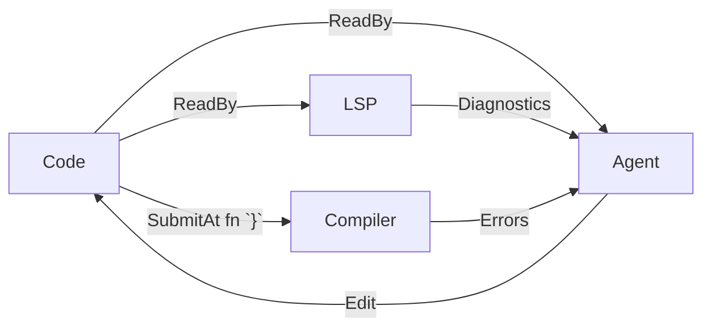

# Week 4 Plan v2.0: Async LSP-Guided Rollback — Implementation + Evaluation

Builds directly on the week3 experiment (function-level LSP-retry and compile-retry) and the architectural conclusions in `rust-analyzer-scope-and-granularity.md` and `kv-cache-truncation.md`. Week 4's deliverable is a **statement-boundary async rollback system** evaluated against **compiler-only retry** on the same dataset under a fixed wall-clock budget.

---

## 1. Carryover from week 3

- Observation (not a scope limit): compile-retry helps most in the 1B–32B range and *hurts* pass@1 at ≥120B.
- **Native-only LSP-retry at function level is inadequate** (0–6 retries vs. 124 for compile-retry on 9B). Need finer granularity + compiler as ground truth.
- **Design decision** (journal conclusion): fast native diagnostics **inline at statement boundaries** + full `cargo check` at function boundaries.
- **Checkpoint granularity** (`rust-analyzer-scope-and-granularity.md §5`): statement-level (`;` / inner `}`).
- **Error classifier** (`rust-analyzer-scope-and-granularity.md §6`): 3-signal procedure with demotion rules while function body is open.

---

## 2. Hypotheses to test

| # | Claim | Test |
|---|---|---|
| H1 | **LSP + compiler** passes compilation (a) **faster in wall-clock** and (b) **with fewer compiler calls** than **compiler-only retry**, at matched wall-clock budget per problem. | Paired comparison per problem per model: wall-clock to first-pass-compile, count of `cargo check` invocations. |
| H2 | **Partial scaling law**: larger models require **fewer compiler calls** to reach compilation, but **not necessarily less wall-clock time** than smaller models, because inference latency scales with size. | Plot `compiler_calls` vs. params (expect monotone-decreasing) and `wall_clock` vs. params (expect non-monotone / U-shape) across all 17 models. |

Both hypotheses are tested on the full 17-model list (§3).

### Why only two arms

Ground truth lives in the compiler. **LSP alone has no ground truth** — it is an inexpensive hint, not a verifier. Comparing against "LSP-only, no compiler" would be comparing two no-ground-truth configurations (LSP-only is ≈ "naked code generation with occasional hints") and isn't meaningful. The question worth answering is whether LSP hints during generation save the expensive compiler loop — which is exactly the two-arm design below.

---

## 3. Model list

Full list retained from week4-plan.md §"Updated Model List (Ollama)". Organized by parameter-count buckets so the scaling curve is complete across 4B → 122B.

### Medium (~70–122B)

| Model | Family | Role |
|---|---|---|
| `qwen3.5:122b` | Qwen | Direct comparison to week3 (122B already evaluated) |
| `nemotron-3-super:120b` | Nemotron | Family coverage at large scale |
| `gpt-oss:120b` | OpenAI | Family coverage (architectural diversity) |
| `deepseek-r1:70b` | DeepSeek | Reasoning model — uses thinking-wrapper (§8) |
| `devstral-2` | Mistral | Coding-specialized at large scale |

### Small (~20–35B)

| Model | Family | Role |
|---|---|---|
| `qwen3.6:35b` | Qwen | Qwen general (latest) |
| `qwen3.5:35b` | Qwen | Qwen general (prior generation) |
| `nemotron-cascade-2` | Nemotron | Family coverage |
| `nemotron-3-nano:30b` | Nemotron | Family coverage |
| `gemma4:31b` | Gemma | Google general (latest) |
| `gpt-oss:20b` | OpenAI | Family coverage |
| `gemma3:27b` | Gemma | Google general (prior generation) |
| `mistral-small3.2:24b` | Mistral | Mistral general |
| `devstral-small-2` | Mistral | Coding-specialized (Mistral family) |

### Micro (~4–9B)

| Model | Family | Role |
|---|---|---|
| `qwen3.5:9b` | Qwen | Direct comparison from week3 |
| `nemotron-3-nano:4b` | Nemotron | Small-scale anchor, extends 0.8B→9B curve |
| `gemma4:e4b` | Gemma | Edge-variant 4B — small-scale anchor |

**Total: 17 models.** Both arms × 17 models × 156 problems × 600s cap → worst-case compute on the order of a single GPU-week; realistically much less because most problems finish well under budget.

### Notes on model availability

Before Day 1, verify each tag resolves in `ollama pull`:

```
for m in qwen3.5:122b nemotron-3-super:120b gpt-oss:120b deepseek-r1:70b \
         devstral-2 qwen3.6:35b qwen3.5:35b nemotron-cascade-2 \
         nemotron-3-nano:30b gemma4:31b gpt-oss:20b gemma3:27b \
         mistral-small3.2:24b devstral-small-2 qwen3.5:9b \
         nemotron-3-nano:4b gemma4:e4b; do
  ollama pull "$m" 2>&1 | tail -1
done
```

Any tag that fails: substitute the closest available sibling and record substitutions in `week4-journal.md`.

### Deprioritization during runs

If total wall-clock time runs tight, run order: **Micro → Small → Medium**. Rationale: H1 and H2 are testable from Micro+Small alone; Medium extends the scaling curve but doesn't change the core finding.

---

## 4. Architecture

### 4.1 Information flow



### 4.2 Generation loop (arm A: LSP + compiler)

**Budget: 600s wall-clock per problem.** No cap on rollback count; rollback is generation assistance, not a judgment mechanism. A small model that rollbacks 100 times but finishes inside the budget is just as successful as a large model that rollbacks 0 times inside the budget. **Time budget is the fair cross-model currency because it reflects real capital cost.**

Invariants:

1. Generation proceeds token-by-token from the model server.
2. An accumulator tracks **delimiter depth** (parens, brackets, braces) outside string/char/comment contexts.
3. On each `;` at depth 0 *or* each `}` closing a block (inner or outer), emit a **checkpoint**: record `(position, buffer_snapshot)`.
4. At each checkpoint, **fire an async LSP pull** (`get_diagnostics`) — non-blocking. Generation continues immediately.
5. When an LSP response arrives:
   - Apply the **§6 classifier** (signals 1–3 from `rust-analyzer-scope-and-granularity.md §6`).
   - If all returned errors are **non-blocking**: discard, continue.
   - If any error is **blocking**: abort generation, trigger rollback (§5).
6. The wall-clock timer is the only termination trigger for the rollback loop. No retry count cap.

### 4.3 Function-boundary slow tier (applies to both arms)

On the *outer* `}` closing a top-level function definition:

1. (Arm A only) Re-run the classifier with `open_fn_body = false`; demotions lift.
2. Fire `cargo check`.
3. If cargo reports errors: rewind the whole function (rustc's file:line is authoritative, not agent-decided), add error to context, regenerate. No per-problem retry count cap — only the 600s budget.

### 4.4 Generation loop (arm B: compiler-only)

Identical to arm A except: **no LSP involvement at all**. Generation proceeds without interruption; at function-boundary, `cargo check` runs; on error, regenerate with rustc feedback. Same 600s budget.

This is the same algorithm as week3's `compile-retry` mode, but without the fixed 3-retry cap — the budget is wall-clock instead.

---

## 5. Rollback policy (precise)

### 5.1 Target selection

Given a set of blocking errors `E = {e_1, ..., e_k}` with ranges `[r_start_i, r_end_i]`:

1. Let `earliest = min(r_start_i)`.
2. Find `B*` = the **latest checkpoint position ≤ earliest**.
3. If no such `B*` exists (error is in the very first statement), roll back to the end of the prompt (regenerate from scratch for this problem).

Earliest-error rule avoids the oscillation pattern (`rust-analyzer-scope-and-granularity.md §5`): if you roll back only to the last error and an earlier one still exists, you'll thrash.

### 5.2 Prompt format — full history visible

Every rollback prepends the new error message to a **rollback history** that stays visible in the prompt across all subsequent attempts for this problem. Model sees every previous attempt's error so it avoids repeating the same mistake without needing explicit oscillation detection.

```
<problem prompt / signature / docstring>

// Previous attempts:
// Attempt 1: E0308 at line 5: expected Result<Response<()>, Error>, found Request<()>
// Attempt 2: E0425 at line 7: cannot find function `foo` in scope
// Attempt 3: E0277 at line 4: the trait bound `Foo: Debug` is not satisfied

<rolled-back buffer up to B*>
```

The rollback history acts as the **oscillation prevention mechanism**: a model that sees its own past errors is unlikely to produce the same one again. No algorithmic oscillation guard needed.

### 5.3 Context compaction at 90% window

When `prompt_tokens + expected_completion_tokens ≥ 0.9 × model_context_window`:

1. Keep: problem prompt, current code prefix, most recent 3 rollback errors verbatim.
2. Compact older errors into a single line listing distinct error codes seen: `// Earlier attempts produced: E0308, E0425 (3 occurrences), E0277`.
3. Never summarize or truncate the code prefix — it is the source of truth for continued generation.

Compaction is a fallback for long-running problems, not a routine operation. Expected to fire on <5% of problems given ~5k-token problem complexity and 32k+ token windows on all listed models.

---

## 6. Error classification

Applied directly from `rust-analyzer-scope-and-granularity.md §6` — do not re-derive.

### 6.1 Blocking codes (native, rust-analyzer)

| Code | Behavior |
|---|---|
| `type-mismatch` (E0308) | Blocking unless `open_fn_body = true` (demote) |
| `unresolved-reference` (E0425) | Blocking unless `open_fn_body = true` (demote) |
| `unresolved-import` (E0432) | Always blocking (module-scope, can't be resolved later in same fn) |
| `no-method` (E0599) | Always blocking |
| `trait-impl-incorrect` (E0277) | Always blocking |
| `missing-match-arm` | Always blocking (fires only on closed match) |

### 6.2 Non-blocking codes

| Code / pattern | Behavior |
|---|---|
| `syntax-error` (any) | Always non-blocking |
| "unterminated" (string/char/comment/raw) | Always non-blocking |
| "expected X" / "unclosed delimiter" | Always non-blocking |
| Diagnostic range at or past `last_complete_pos` | Always non-blocking |

### 6.3 Temporal stability

Signal 3 from §6 — optional, enable only if the primary classifier shows a high false-positive rate on the Day 4 validation corpus.

---

## 7. Evaluation

### 7.1 Metrics

**Primary:**
- **Compile rate**: % of 156 problems whose final generation compiles under `rustc` within the 600s budget.
- **Pass@1**: % passing the hidden test suite within budget.
- **Wall-clock time to first-pass-compilation** (*primary H1 metric*): time from generation start to a successfully-compiling function. ∞ for problems that timeout.
- **Compiler calls per problem** (*primary H1 metric*): count of `cargo check` invocations.
- **Rollback count per problem** (arm A only): total rollback events. Reported but not compared against arm B (arm B has no rollbacks by definition).
- **Tokens generated** (including discarded).

**Profiling (per-problem breakdown from §8.3):**
- **Per-category wall-clock breakdown**: time spent in each category (generation, prompt-ingestion, lsp-roundtrip, lsp-wait, classifier, cargo-check, rollback-overhead, thinking, idle).
- **Rollback-overhead median** (arm A): time from "blocking error detected" to "new request emits first token." Primary input for the week5 KV-cache motivation.
- **Cargo-check distribution**: per-invocation wall time; report cold-call (first per problem) separately from incremental calls.

### 7.2 Arms

- **Arm A — LSP + compiler**: §4.2 + §4.3. Statement-boundary async LSP rollback with §6 classifier, with function-boundary compiler retry. Both loops bounded only by the 600s wall-clock budget.
- **Arm B — compiler only**: §4.4. Week3 compile-retry mode without the 3-retry cap; same 600s budget.

Both arms use identical prompts, same model server, same dataset, same evaluation harness. The only difference is whether LSP hooks fire during generation.

### 7.3 Success criteria

| H | Criterion |
|---|---|
| H1(a) faster | Median wall-clock to first-pass-compile (arm A) < median (arm B), per model, on at least 12 of 17 models. |
| H1(b) fewer compiler calls | Median `compiler_calls` (arm A) < median (arm B), per model, on at least 12 of 17 models. |
| H2 partial scaling law | Across 17 models, Spearman correlation between params and `compiler_calls` is negative (ρ ≤ −0.4); Spearman between params and `wall_clock` is not monotone (|ρ| < 0.4 OR sign flips in a size bin). |

Negative result is publishable — H1/H2 failing cleanly points to what doesn't work.

### 7.4 Dataset

MultiPL-E HumanEval Rust — 156 problems, same as week 3.

---

## 8. Infrastructure

| Component | Choice | Rationale |
|---|---|---|
| LLM server | Ollama raw completion | Matches week3; abort = HTTP disconnect, simple |
| KV-cache | **None for week 4** | See `kv-cache-truncation.md §6.1` — stop + re-prompt, accept cold-cache cost. Token-level HF migration is week 5. |
| Statement-boundary detector | Brace/semicolon tracker w/ string-comment awareness; tree-sitter fallback for macros | Week 1 plan §4 already scoped this |
| LSP client | Existing `soundcode/analyzer.py` | Unchanged |
| Classifier | New module `soundcode/eval/classifier.py` | Implements §6 from rust-analyzer-scope note |
| History manager | New module for prompt-history tracking + compaction (§5.2, §5.3) | Owns the rollback log; called on every rollback event |
| Runner | New `soundcode/eval/rollback_runner.py` | Parallel to existing `run_baseline` / `run_lsp` / `run_compiler` |
| Thinking-model wrapper | New `soundcode/eval/thinking_wrapper.py` (§8.1) | Required for `deepseek-r1:70b`, any other reasoning models |
| Profiler | New `soundcode/eval/profile.py` (§8.3) | Per-problem event log; feeds §7.1 breakdown |

### 8.1 Thinking-model wrapper — two modes to evaluate

For models that emit `<think>...</think>` traces:

- **Stream-side**: wrapper buffers all tokens inside `<think>...</think>`, emits nothing downstream. Statement-boundary detector only sees tokens after `</think>`.
- **Rollback-side**: when rollback fires, the wrapper has two possible behaviors — evaluate both as an ablation:

    | Mode | Behavior on rollback |
    |---|---|
    | **T-A** (re-enter thinking) | Inject error into prompt with instruction "reconsider, then continue." Model is expected to emit a fresh `<think>` block before code. Wrapper buffers it again. |
    | **T-B** (skip thinking) | Inject error + instruction "directly continue code from `<cursor>`." Model is expected *not* to think; any emitted `<think>` is stripped silently. |

- **Thinking timeout**: if `</think>` is not emitted within 60s of generation start (or after a rollback in mode T-A), abort the attempt and record as a failed attempt. Prevents indefinite thought loops.

**Evaluate T-A vs. T-B on `deepseek-r1:70b` only**. Whichever wins by ≥2pp on compile rate is used for final reported results on that model; record both in the journal.

### 8.2 History/compaction module sketch

```python
class RollbackHistory:
    def __init__(self, ctx_window: int):
        self.entries: list[tuple[int, str, str]] = []  # (line, code, message)
        self.ctx_window = ctx_window

    def add(self, diag: Diagnostic): ...
    def render(self, token_budget_remaining: int) -> str:
        # If len(render_full()) > 0.9 * ctx_window: compact
        ...
```

### 8.3 Profiler

Per-problem, per-event timing log. Primary use: attribute wall-clock cost to categories so "arm A is slower" becomes diagnosable, not a dead-end observation. Feeds the profiling metrics in §7.1 and the week5 KV-cache motivation.

#### Categories

| Category | Span | Why it matters |
|---|---|---|
| `generation` | Time between consecutive emitted tokens | Dominant cost on large models; baseline to subtract everything else from |
| `prompt-ingestion` | Request submit → first emitted token (TTFT) | Post-abort re-prompts pay full prefill cost here; single largest week4 inefficiency |
| `lsp-roundtrip` | LSP request → response, per call | LSP server behavior independent of generation |
| `lsp-wait` | Time generation was **blocked** waiting for LSP (should be ~0 given async design) | Sanity check: nonzero = async broken |
| `classifier` | Time inside §6 decision procedure per diagnostic | Likely trivial; confirm |
| `boundary-detect` | Brace/semicolon tracker, per token | Likely trivial |
| `cargo-check` | Wall time of `cargo check` invocations | Highly variable (cold ~10–30s, incremental <1s); report per-invocation |
| `rollback-overhead` | "Blocking error detected" → "new request emits first token" | Abort + prompt-rebuild + ingestion combined; single most important number for week4 → week5 motivation |
| `thinking` (reasoning models) | Inside `<think>...</think>` blocks | Separates thinking from "useful" generation; fair T-A vs. T-B comparison |
| `idle/other` | Residual | Should be <5%; large residual = instrumentation gap |

#### Module sketch

```python
class Profile:
    def __init__(self, problem_id: str):
        self.pid = problem_id
        self.events: list[tuple[str, int, int, dict]] = []  # (category, t_start_ns, t_end_ns, meta)

    @contextlib.contextmanager
    def span(self, category: str, **meta):
        t0 = time.perf_counter_ns()
        try:
            yield
        finally:
            self.events.append((category, t0, time.perf_counter_ns(), meta))

    def dump(self, path: Path) -> None:
        # One JSON per (problem, model, arm), parallel to results/{model}_arm{A,B}.json
        ...
```

#### Implementation rules

- **Raw events only**; aggregation happens at analysis time (day 6). Each event records `(t_start_ns, t_end_ns)` — the analyzer computes durations and overlaps. This lets you re-slice later without re-running.
- **Serial vs. parallel views**: because generation and LSP run concurrently, `sum(span.duration)` ≠ wall-clock. The analyzer must compute both: (a) "total time spent in category X" (sum of durations) and (b) "wall-clock critical path" (merge overlapping intervals). Both matter; don't conflate.
- **Rollback-overhead timing**: timestamp both the abort request send and the first token of the next response. Naive instrumentation (only timing the abort call itself) will miss the dominant re-ingestion cost.
- **Overhead**: `time.perf_counter_ns()` is ~50ns/call. Negligible even at per-token granularity.
- **Output**: `results/profile_{model}_arm{A,B}_{problem}.json`, ~1–10 KB each.

#### Analysis artifacts (day 6)

- Stacked bar per model: per-category wall-clock for arm A vs. B.
- Histogram of `rollback-overhead` durations (across all rollbacks).
- Scatter: `cargo-check` cost vs. code length.
- Scatter: `lsp-wait` vs. rollback frequency (to confirm async integrity).

---

## 9. Out of scope

Explicitly deferred — documented so they don't re-enter scope mid-week:

| Item | Deferred to |
|---|---|
| Token-level KV-cache truncation (HF transformers path) | Week 5 |
| Multi-file / whole-project generation | Future |
| Agent-decided "which module to rewrite on compile error" | Rejected as over-engineered; use rustc's file:line directly |
| Push diagnostic integration beyond function-level | Future |
| LSP-only arm (no compiler) | Rejected — LSP lacks ground truth (§2) |

---

## 10. Concrete steps with timebox

| Day | Task | Deliverable |
|---|---|---|
| Day 1 | Pull all 17 models; verify raw-completion mode; verify abort semantics on streaming endpoints | `models_smoke_test.json` — every available model generates and aborts cleanly |
| Day 2 | Statement-boundary detector + tests on 50 hand-labeled Rust snippets | `soundcode/eval/boundary.py` + test file with ≥95% accuracy |
| Day 3 | Classifier module (§6) + history/compaction module (§5.2, §5.3) + profiler module (§8.3) + tests | `soundcode/eval/classifier.py`, `history.py`, `profile.py`, tests |
| Day 4 | `rollback_runner.py` integration + thinking-model wrapper (§8.1) + profiler instrumentation wired into all spans + **validation test suite** (§10.1) on both arms | All validation tests pass; runner modules complete; profile dumps sane |
| Day 5 | Full eval: 156 problems × 17 models × 2 arms. Micro → Small → Medium order. Profiler dumps per problem. | `results/{model}_arm{A,B}.json` + `profile_{model}_arm{A,B}_{problem}.json` per model |
| Day 6 | Analysis: H1(a), H1(b), H2 + profiler breakdown. Scaling plots (compiler_calls vs. params, wall_clock vs. params) + stacked-bar per-category breakdown + rollback-overhead distribution | `analyze_week4.py`, results table, 4 plots, paired comparison per model |
| Day 7 | `week4-journal.md` writeup: results + qualitative error examples + thinking-mode ablation result + next-week decisions | Journal ready to read |

### 10.1 Validation test suite (Day 4 gate)

Must pass before spending GPU-hours on the full eval. Each case runs in seconds:

| Test | What it validates |
|---|---|
| Happy path: generate a known-clean function, no rollbacks, budget not touched | Base plumbing end-to-end |
| Single-rollback path: seeded prompt triggering one E0308 | Classifier + rollback target selection + prompt injection |
| Multi-rollback path: 5+ rollbacks on one problem | History accumulation, prompt rendering |
| Compaction path: synthetic problem pushing prompt past 90% window | Compaction rule activates correctly |
| Wall-clock cap path: artificially slow generation → 600s timeout fires cleanly | Budget enforcement |
| Thinking-model path (T-A): `deepseek-r1:70b` on 1 problem with re-enter mode | Wrapper correctness, thinking timeout |
| Thinking-model path (T-B): same problem with skip mode | T-A / T-B equivalence for non-rollback case |
| Malformed LSP response: inject a garbled diagnostic | Error handling doesn't crash the loop |
| Compiler-only borrow-check error: force an E0382 that LSP misses | Function-boundary slow tier activates |
| Concurrent LSP: fire generation with artificial LSP latency spikes | Async correctness, no race on buffer |
| Profiler output: run happy path + single-rollback path; inspect dumped profile JSON | Every category in §8.3 appears with sane magnitudes; `idle/other` < 5% of total; no overlapping spans in same category |

A failing case blocks Day 5. Fix or explicitly scope down.

---

## 11. Risks and mitigations

| Risk | Mitigation |
|---|---|
| Ollama abort+re-prompt has high overhead (cold KV on every rollback) | Tolerate — this is the baseline week 5 will beat. Measure overhead explicitly and include in §7.1. |
| Classifier produces too many false positives on partial code | Enable signal-3 (temporal stability) check. Cost: double LSP round-trips — acceptable at this scale. |
| Pathological problem consuming full 600s on one model | Accepted — that's a real outcome. Reported as a timeout; don't truncate it out of the data. |
| LSP server crashes during long eval runs | Restart analyzer every 50 problems (already done in `test_workspace` flow) |
| Statement-boundary detector mis-triggers inside `println!` / `vec!` / other macros | Tree-sitter fallback for boundary detection inside macro bodies |
| One or more models from §3 fail to load | Log + continue; report results on loaded subset with substitutions noted |
| Thinking model hangs in `<think>` | 60s thinking timeout; attempt recorded as failed |
| Rollback history grows too long before compaction fires | Compaction threshold is 90%; add instrumentation to confirm <5% of problems hit it |

---

## 12. What would falsify the approach

Preregistered — helps prevent post-hoc rationalization.

- **If H1(a) fails** (wall-clock arm A ≥ arm B on majority of models): LSP overhead costs more than it saves. Switch focus to error-feedback prompt engineering over the compiler loop only.
- **If H1(b) fails** (compiler calls arm A ≥ arm B): LSP is not catching errors the compiler would have caught — its hints aren't reducing compiler load. Reconsider which diagnostic codes to act on, or whether the classifier is too conservative.
- **If H2 fails with strong monotone wall-clock scaling** (larger is strictly faster): the partial-scaling assumption is wrong; inference-latency is swamped by retry-count savings. Restructure the scaling narrative around "bigger is always better for this workflow."
- **If H2 fails with strong monotone compiler-call scaling** (compiler calls doesn't drop with size): larger models aren't producing cleaner first-pass code — the premise that quality scales with size doesn't hold for this task. Would push toward investigating *why* (training data contamination? overfitting? task difficulty ceiling?).

Any of these are informative failures; report them as-is.
