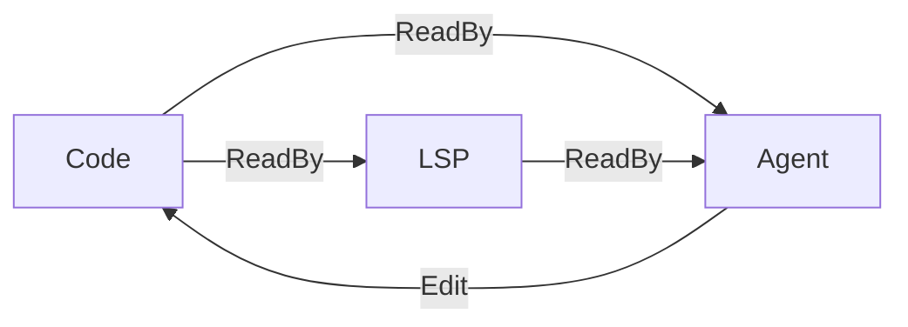
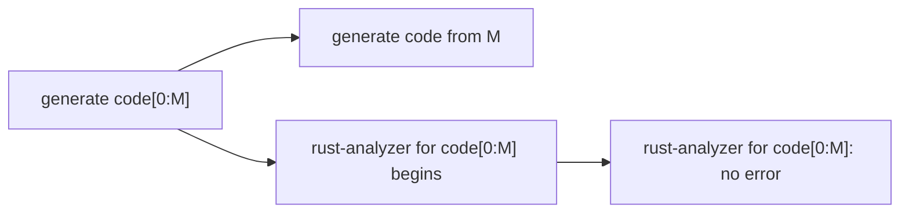
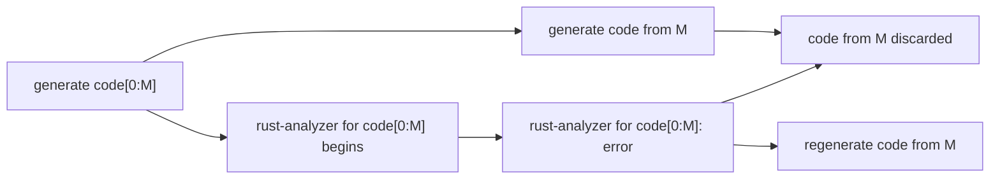

## Updated Model List (Ollama)

### Medium Models
- `qwen3.5:122b`
- `nemotron-3-super:120b`
- `gpt-oss:120b`
- `deepseek-r1:70b`
- `devstral-2`

### Small Models
- `qwen3.6:35b`
- `qwen3.5:35b`
- `nemotron-cascade-2`
- `nemotron-3-nano:30b`
- `gemma4:31b`
- `gpt-oss:20b`
- `gemma3:27b`
- `mistral-small3.2:24b`
- `devstral-small-2
`
### Micro Models
- `qwen3.5:9b`
- `nemotron-3-nano:4b`
- `gemma4:e4b`

Note: this machine has 96GB VRAM. Small models and micro models can fit into VRAM with vLLM and Ollama. Medium models can fit into VRAM with Ollama, but not necessarily with vLLM.

While KV-cache management is more efficient, we temporarily skip it for this week. Therefore, consider Ollama as LLM server first for simplicity. 

## Overall Framework
### Information Flow


### Procedure
(1) No error

(2) Error occurs



## Rollback Mechanism
In this section, we abstract LSP communication away, and assume that there exists a function that tells in which line the current error begins. For example, given the following partial code
```Rust
pub fn response(req: Request<()>) -> http::Result<Response<()>> {
    match req.uri().path() {
        "/" => req,
        "/foo" => req,
        "/bar" => req,
        _ => req,
    }
}
```
rust analyzer produces
```stderr
error[E0308]: mismatched types
 --> src/my_module.rs:5:16
  |
3 | pub fn response(req: Request<()>) -> http::Result<Response<()>> {
  |                                      -------------------------- expected `Result<Response<()>, http::Error>` because of return type
4 |     match req.uri().path() {
5 |         "/" => req,
  |                ^^^ expected `Result<Response<()>, Error>`, found `Request<()>`
  |
  = note: expected enum `Result<Response<()>, http::Error>`
           found struct `http::Request<()>`

```
Once the agent receives this error, LLM inference is aborted (but chat is still active). Code since `line 3` (beginning of error block) is removed. This error message is aggregated to prompt, and the model is instructed to start writing `line 3` again. 

## LSP Error Detection
The agent asynchronously communicates with `rust-analyzer` client at the frequency of per line. The agent never waits for `rust-analyzer` but instead makes an async call of `rust-analyzer` client and continues to generate code. As long as error is never detected by `rust-analyzer`, the agent never stops. In case `rust-analyzer` sends back a response indicating an error, rollback mechanism is activated as described in section **Rollback Mechanism**. 

### Types of Errors
Incomplete code should never be considered as error. Therefore, reponses like "unclosed delimiter" is never blocks code generation, but errors like "mismatched types' do trigger rollback. 

## Combining LSP and Compiler
While LSP detects error incrementally for partial code, compiler has the final authority to decide the correctness of a code. After the entire project is created, compiler is called to inspect the code. In case compiler generates an error, the agent is informed and asked to determine which files, which modules (functions, structs, traits, and etc. in a file) need to be rewritten. When rewriting a module, rollback mechanism is applied again until the module is completed and passes all `rust-analyzer` checks. 

## Context Window Limit Management. 

When the LLM session hits 90% of token limit, summarize the existing session, and start a new session with this summary. 

## Concrete Steps
1. Prepare environment
- Install Ollama Python SDK. 
- Gather docs for Ollama Python and CLI. 
- Pull listed LLMs from Ollama. 
2. Explore the project
3. Implement the framework
4. Implement rollback
4. Implement LSP wrapper for error detection