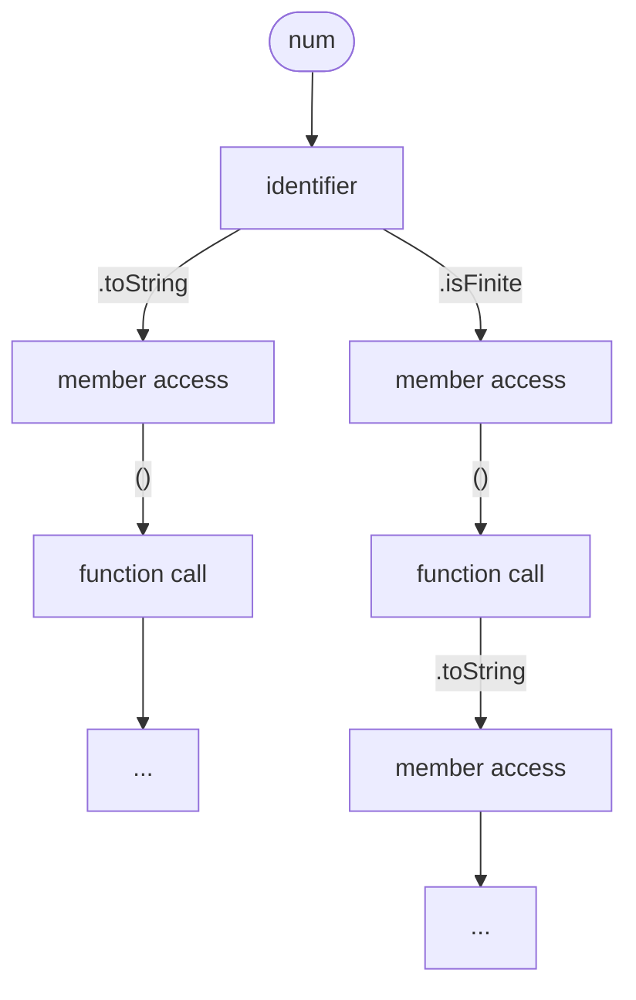
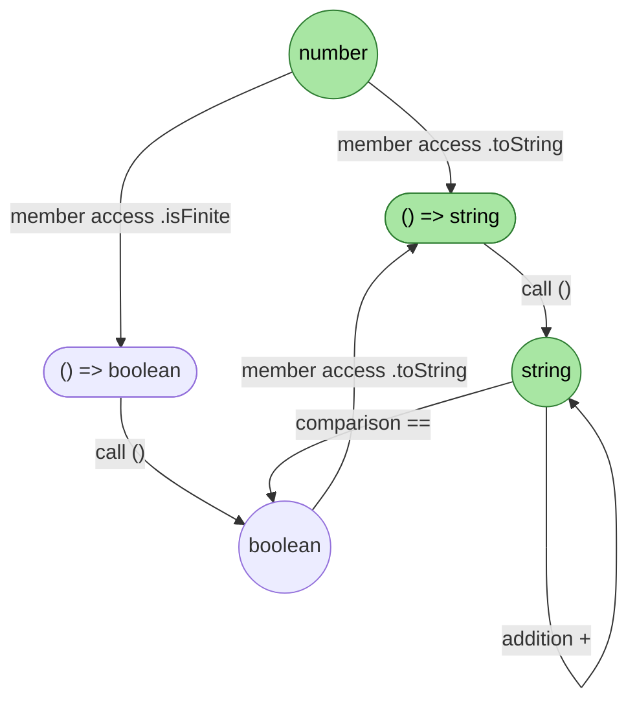

# [Backus-Naur Form](https://en.wikipedia.org/wiki/Backus%E2%80%93Naur_form)
## Concepts
- **Non-terminal symbols**: categories or variables that can be replaced.
- **Terminal symbols**: fixed, literal elements (keywords and punctuation).
- **Derivation rules**: `<symbol> ::= __expression`. The instructions for replacing non-terminal symbols with specific combinations of symbols. 

## C++ arithmetic BNF
```
// ---------- Operator layers (loosest → tightest) ----------
<expression>     ::= <additive-expr>

<additive-expr>  ::= <multiplicative-expr>
                   | <additive-expr> "+" <multiplicative-expr>
                   | <additive-expr> "-" <multiplicative-expr>

<multiplicative-expr> ::= <unary-expr>
                   | <multiplicative-expr> "*" <unary-expr>
                   | <multiplicative-expr> "/" <unary-expr>
                   | <multiplicative-expr> "%" <unary-expr>

<unary-expr>     ::= <primary-expr>
                   | "+" <unary-expr>
                   | "-" <unary-expr>

<primary-expr>   ::= <literal>
                   | <identifier>
                   | "(" <expression> ")"

// ---------- Terminals ----------
<literal>        ::= <integer-literal> | <float-literal>

<integer-literal> ::= <digit> | <integer-literal> <digit>

<float-literal>  ::= <integer-literal> "." <integer-literal>
                   | <integer-literal> "."
                   | "." <integer-literal>

<identifier>     ::= <letter> | <identifier> <letter> | <identifier> <digit>

<digit>          ::= "0" | "1" | "2" | "3" | "4" | "5" | "6" | "7" | "8" | "9"
<letter>         ::= "a" | "b" | ... | "z" | "A" | ... | "Z" | "_"
```

# [Context-free Grammar](https://en.wikipedia.org/wiki/Context-free_grammar)
## Concepts
$G = (V,\Sigma,R,S)$
- $V$: finite set of nonterminal character or a variable (phrase or clause in the sentence).
- $\Sigma$: finite set of terminals, disjoint from $V$.
- $R$: finite relation in $V\times(V\cup\Sigma)^*$
- $S$: start variable (start symbol), used to reprsent the whole sentence. an element of $V$. 

# [ROCODE: Integrating Backtracking Mechanism and Program Analysis in Large Language Models for Code Generation](https://arxiv.org/abs/2411.07112)

### Key Issues
- Where to roll back
- Where to roll back to
- How to avoid previous errors
## Key steps
### Incremental Error Detection
Statement $s_i = \mathcal{M}(x,S,S_{:i-1})$

Error $e_i = \mathcal{C}(S_{:i-1}||s_i) = \{\text{result, type, lineno, offset}\}$

### Strategic Rollback
Rollback point $r_e = [e.\text{lineno}, e.\text{offset}]$

Entropy at position $t$: $H_t = -\sum_{j=1}^{|V|} p(y_t=v_j|y_{<t},x)\log p(y_t=v_j|y_{<t},x)$

Rollback to highest entropy position: 

$t^* = \argmax_{t\in[0,|y|]}H_t$

$r_h = [\text{ConvertToLineno}(t^*,y)0]$

### Constraint Regeneration

Exponentially decaying penalty: $PN(v|y_{<t}) = 
\begin{cases}
    \lambda^{t-r}, \text{if } v=y_t, \\
    1, \text{otherwise}
\end{cases}$

# [SemGuard: Real-Time Semantic Evaluator for Correcting LLM-Generated Code](https://arxiv.org/abs/2509.24507v1)

## Limitations of ROCODE
- Post-generation semantic detection
- Imprecise backtracking-point location

## Approach
- Lightweight semantic evaluator on partial code

## Challenge
- Scarcity of line-level semantic annotations
- Undecidable semantic validity of partial code

## Data pipeline: *SemDiff*

# [Type-Constrained Code Generation with Language Models](https://arxiv.org/abs/2504.09246)

## Background: Constrained Decoding

Input: LLM, prompt $x$, completion engine $\text{CE}_L$ for language $L$

Output: Program $s$ such that $s\in L$

**Algorithm 1** Vanilla LLM-based code generation (without blue highlights) vs. constrained decoding (with blue highlights)

**Input:** LLM, prompt $x$, completion engine $CE_L$ for language $L$

**Output:** Program $s$ such that $s \in L$

1. initialize $s$
2. **while** true **do**
3. &nbsp;&nbsp;&nbsp;&nbsp;$v := \mathrm{LLM}(x \circ s)$ // probability distribution
4. &nbsp;&nbsp;&nbsp;&nbsp;**while** true **do**
5. &nbsp;&nbsp;&nbsp;&nbsp;&nbsp;&nbsp;&nbsp;&nbsp;$t \sim v$
6. &nbsp;&nbsp;&nbsp;&nbsp;&nbsp;&nbsp;&nbsp;&nbsp;**if** $CE_L(s \circ t)$ **then** break
7. &nbsp;&nbsp;&nbsp;&nbsp;&nbsp;&nbsp;&nbsp;&nbsp;**elif** $t = EOS$ **and** $s \in L$ **then** break
8. &nbsp;&nbsp;&nbsp;&nbsp;&nbsp;&nbsp;&nbsp;&nbsp;**else** $v[t] := 0$; normalize $v$
9. &nbsp;&nbsp;&nbsp;&nbsp;**if** $t = EOS$ **then** break
10. &nbsp;&nbsp;&nbsp;&nbsp;$s := s \circ t$ // concatenation
11. **return** $s$

Completion Engine $\text{CE}_L$: returns whether partial program $s$ can be completed to a well-formed program in $L$, i.e. whether there exists a string $s'$ s.t. $s\circ s' \in L$

**Definition 1**

For a given language $L$, its prefix language is $L^P := \{s | \exists s': s \circ s' \in L\}$

## Figure 2: Prefix automaton

States are partial expressions; edges are the next grammar/AST construct appended. Starting from `num`, each path is a way the prefix can be extended (e.g. `num.toString()` on the left, `num.isFinite()...` on the right).



## Figure 3: Partial type search graph

Nodes are types; edges are operations that transform one type into another. Green nodes mark types reachable on a path toward the target type. From `number`, member accesses yield function types, calling them yields `string`/`boolean`, and further operations (`addition +`, `comparison ==`, `.toString`) move between types.



